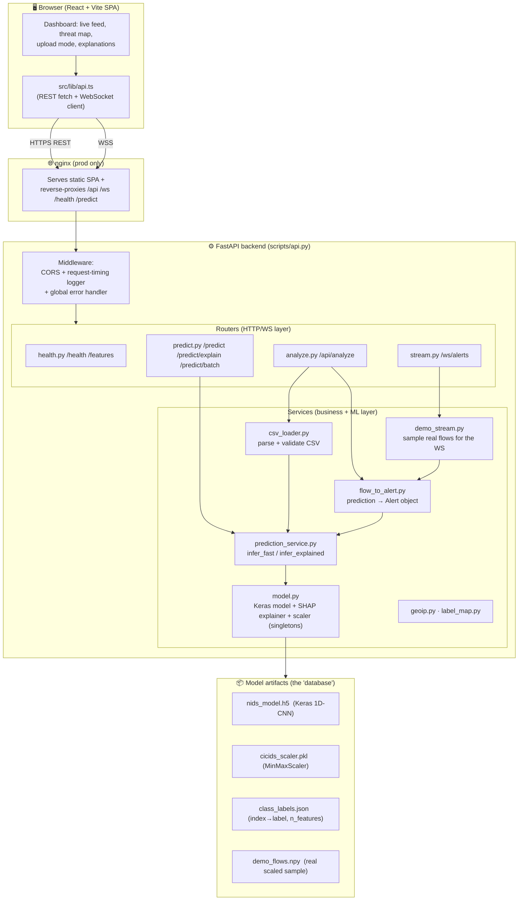

# 00 · Project Overview

> Read this once, slowly. Everything else hangs off the mental model you build here.

---

## 1. The business problem

Networks are constantly probed and attacked: denial-of-service floods, port scans, brute-force
login attempts, botnet traffic, web exploits. A **Network Intrusion Detection System (NIDS)**
watches network traffic and raises an alert when traffic looks malicious.

Classic NIDS (e.g. Snort, Suricata) are **signature-based**: a human writes rules ("if packet
matches this byte pattern → alert"). That works for *known* attacks but is brittle — it misses
novel variants and needs constant rule maintenance.

This project takes the **machine-learning / anomaly-classification** approach instead:

> Instead of matching signatures, **learn** the statistical fingerprint of each attack family
> from labelled historical traffic, then classify new traffic by similarity to those patterns.

The unit of analysis is a **network flow** — a summary of one conversation between two endpoints
(duration, packet counts, byte rates, inter-arrival times, TCP flag counts, etc.). The tool that
produces these is **CICFlowMeter**, and it emits **78 numeric features** per flow.

### What "good" looks like

- Given a flow's 78 features, output one of **11 labels**: `BENIGN` or one of 10 attack families.
- Be **accurate** (this model: **99.48%** test accuracy, **97.67% macro-F1**).
- Be **explainable** — a SOC (Security Operations Center) analyst won't trust a black box, so the
  system can say *which features drove the decision* (via **SHAP**).
- Be **real-time-ish** — stream alerts as they happen to a dashboard.

---

## 2. Who uses it

| User | What they do | Which part they touch |
|------|--------------|-----------------------|
| **SOC analyst / security engineer** | Watches the live alert feed, investigates flagged flows, reads the per-flow explanation, looks at the threat map | Frontend dashboard → `/ws/alerts`, `/predict/explain` |
| **Analyst doing offline triage** | Uploads a CSV of captured flows (e.g. a CICIDS day) and gets a classified report + summary | Frontend "Upload Mode" → `POST /api/analyze` |
| **Another service / script (machine client)** | Sends one flow or a batch and gets predictions back as JSON | `POST /predict`, `/predict/explain`, `/predict/batch` |
| **ML engineer (you)** | Retrains the model, re-exports the scaler/labels, converts to TFLite | `scripts/preprocessing.py`, `scripts/NIDS_new_training.ipynb`, `scripts/convert_to_tflite.py` |

> **Interview note.** When asked "who are the users," lead with the **SOC analyst** and the
> **explainability** need. It frames every later decision (SHAP, severity mapping, the dashboard)
> as serving a real human workflow, not gold-plating.

---

## 3. Core functionality (the five things it does)

1. **Fast prediction** — `POST /predict`: 78 features in → `{class, index, confidence}` out. No explanation, lowest latency.
2. **Explained prediction** — `POST /predict/explain`: same input, plus full probability distribution and **SHAP feature attributions** (which features pushed the decision toward the predicted class).
3. **Batch CSV scoring** — `POST /predict/batch` (raw class list) and `POST /api/analyze` (rich alerts + summary): upload a CSV of many flows, get them all classified.
4. **Live alert stream** — `GET /ws/alerts` (WebSocket): the server samples real flows, classifies them, and pushes one `Alert` per second to every connected dashboard. This is the "demo / monitoring" experience.
5. **Introspection** — `GET /health`, `GET /features`: report model metadata (class count, feature names, SHAP background size).

---

## 4. Overall architecture (one diagram to rule them all)



### The layering in words

```
HTTP/WS request
   → Router (FastAPI APIRouter)        # transport: parse path/body, status codes
   → Service (prediction/csv/stream)   # business logic: validate, orchestrate
   → model.py singletons               # the ML primitives: scaler, model, explainer
   → numpy / TensorFlow / SHAP         # the math
   → response (Pydantic model → JSON)
```

There is **no repository layer and no database** because there is nothing to persist — every
request is a pure function of its input plus the loaded model. See
[04-Data-and-Model-Store.md](04-Data-and-Model-Store.md) for why that's the right call here.

---

## 5. The main engineering challenges (and how they were solved)

| Challenge | Why it's hard | Solution in this repo |
|-----------|---------------|------------------------|
| **Heavy model load** | TensorFlow + a Keras model + a SHAP explainer take seconds to load and ~GB of RAM. You can't pay that on every request. | **Lazy singletons + startup warm-up.** `load_models()` runs once in FastAPI's `lifespan` at boot; `model.py` keeps module-level `model`/`explainer` globals. A warm-up `predict()` primes TF graph compilation. ([model.py](../../scripts/app/services/model.py)) |
| **Explainability is slow** | SHAP `GradientExplainer` does many gradient passes — far slower than a forward pass. | **Two-tier API:** `/predict` (fast, no SHAP) vs `/predict/explain` (SHAP). In batch `/api/analyze`, SHAP is **capped** to the first `ANALYZE_SHAP_CAP` (default 50) flows. ([analyze.py](../../scripts/app/routers/analyze.py)) |
| **Input is messy** | Real flow CSVs contain `inf`/`NaN` (e.g. `Flow Bytes/s` divide-by-zero), wrong column order, extra columns. | **Defensive `csv_loader`:** strips whitespace, checks all 78 columns exist, reorders to the scaler's expected order, coerces to numeric, replaces `±inf`/`NaN` with `0.0`, caps row count. ([csv_loader.py](../../scripts/app/services/csv_loader.py)) |
| **Feature-order correctness** | The model is order-sensitive: the 78 inputs must be in the exact order the scaler was fit on. A silent re-order = garbage predictions. | **Single source of truth:** `FEATURE_NAMES` comes from the scaler's `feature_names_in_`. Every path (dict input, CSV) reorders to that list. A boot-time assertion checks `len(FEATURE_NAMES) == N_FEATURES`. |
| **Deploy from a clean clone** | The 149 MB processed dataset (`X_dcnn.npy`) is too big to commit; HF Spaces runs as a non-root user with a read-only HOME. | **Graceful fallbacks:** SHAP background falls back `X_dcnn.npy → demo_flows.npy → synthetic random`; the demo stream falls back `raw CSVs → demo_flows.npy → background`. Docker points all caches at `/tmp`. ([model.py](../../scripts/app/services/model.py), [demo_stream.py](../../scripts/app/services/demo_stream.py), [Dockerfile](../../Dockerfile)) |
| **Real-time delivery** | Polling for new alerts is wasteful and laggy. | **WebSocket** (`/ws/alerts`) pushes alerts server→client at `STREAM_RATE_HZ`. The client auto-reconnects with exponential backoff. ([stream.py](../../scripts/app/routers/stream.py), [api.ts](../../frontend/src/lib/api.ts)) |

---

## 6. Why this architecture was chosen (the short version)

- **FastAPI** — async-native (needed for WebSockets), Pydantic validation for free, auto OpenAPI docs (`/docs`), tiny boilerplate. The natural Python choice for an ML inference service. (Full justification in [09-Design-Decisions.md](09-Design-Decisions.md).)
- **Layered (routers / services / artifacts)** — keeps transport concerns (HTTP codes, WS frames) out of ML logic, so the same `infer_fast`/`infer_explained` functions are reused by four different routers.
- **Stateless** — no DB, no session. Any number of identical replicas can serve traffic; you scale by cloning containers behind a load balancer. (See [08-Performance-and-Scalability.md](08-Performance-and-Scalability.md).)
- **Singletons for the model** — the model is read-only, expensive to build, and thread-safe to call. A process-level singleton is the textbook fit.
- **1D-CNN over tabular features** — flows are *ordered numeric vectors*; 1D convolutions learn local feature interactions cheaply. (Tradeoffs vs XGBoost/Transformer in [05-AI-ML-Pipeline.md](05-AI-ML-Pipeline.md).)

---

## 7. Tech stack at a glance

| Concern | Choice |
|---------|--------|
| API framework | **FastAPI** + **Uvicorn** (ASGI) |
| Validation/serialization | **Pydantic** v2 models ([schemas.py](../../scripts/app/schemas.py)) |
| ML runtime | **TensorFlow-CPU / Keras** (`nids_model.h5`) |
| Explainability | **SHAP** `GradientExplainer` |
| Preprocessing | **scikit-learn** `MinMaxScaler` + `LabelEncoder`, **imbalanced-learn** `RandomUnderSampler` |
| Numerics / IO | **NumPy**, **pandas**, **joblib** |
| Geo (optional) | **geoip2** + MaxMind GeoLite2 (disabled unless a `.mmdb` is mounted) |
| Frontend | **React + Vite + TypeScript** (served by **nginx** in prod) |
| Packaging | Multi-stage **Docker**, **docker-compose** for the full stack |
| Hosting | **Hugging Face Spaces** (backend, 16 GB free RAM) + **Vercel** (frontend) |
| Tests | **unittest** + FastAPI `TestClient` ([tests/](../../tests/)) |

---

## 8. Repository map (where everything lives)

```
nids/
├── scripts/
│   ├── api.py                 # FastAPI app: lifespan, middleware, router wiring
│   └── app/
│       ├── config.py          # env-driven Settings (NIDS_* overrides)
│       ├── schemas.py         # Pydantic request/response models
│       ├── routers/           # health, predict, analyze, stream(WS)
│       └── services/          # model, prediction_service, flow_to_alert,
│                              # csv_loader, demo_stream, geoip, label_map
├── models/new/                # nids_model.h5, .tflite, cicids_scaler.pkl, class_labels.json
├── data/demo_flows.npy        # small committed real-flow sample (~150 KB)
├── scripts/preprocessing.py   # offline: raw CSV → scaled, reshaped, saved arrays
├── scripts/NIDS_new_training.ipynb  # offline: build/train/export the CNN
├── scripts/convert_to_tflite.py     # offline: H5 → TFLite (+ optional quantization)
├── frontend/                  # React/Vite SPA + nginx.conf + Dockerfile
├── tests/                     # unittest suite
├── Dockerfile, docker-compose.yml, DEPLOYMENT.md
└── README.md
```

> **Mental model to carry forward:** there are **two worlds** in this repo. The **offline/training
> world** (`preprocessing.py`, the notebook, `convert_to_tflite.py`) produces artifacts. The
> **online/serving world** (`scripts/app/`) loads those artifacts and answers requests. They meet
> only through the saved files in `models/new/`. Keep them separate in your head — interviewers
> love candidates who draw this line cleanly.
