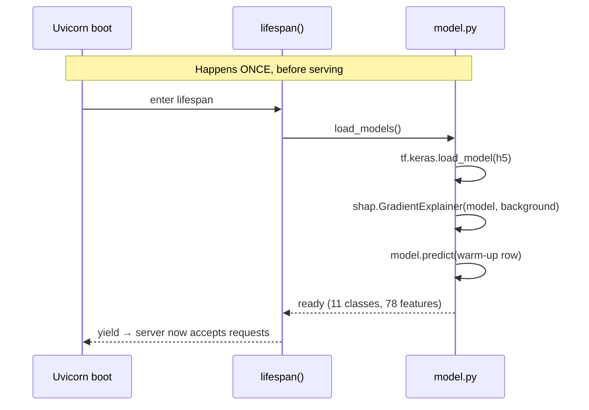
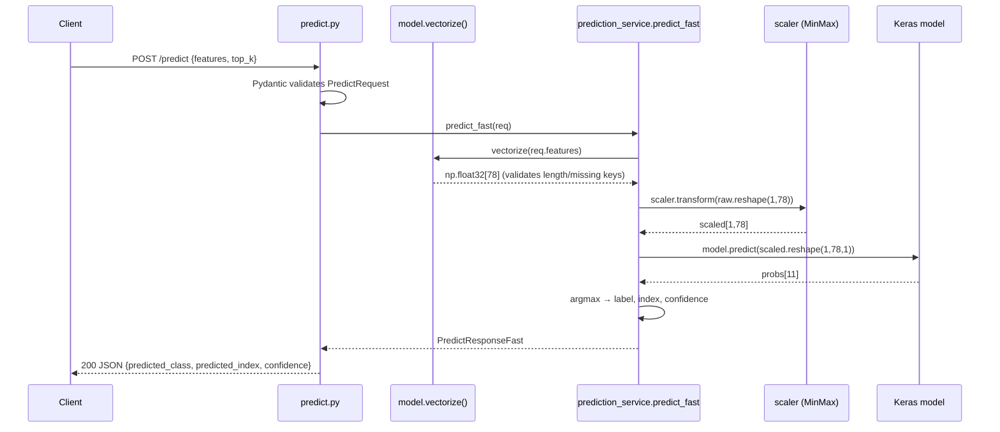
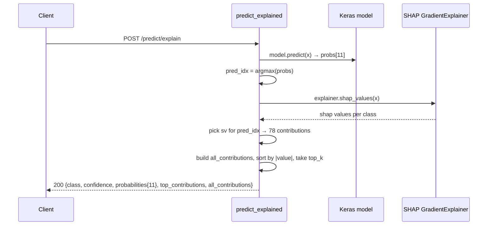
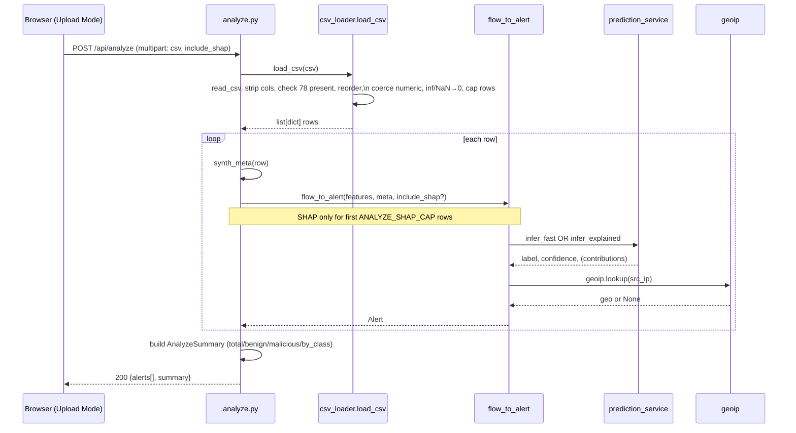
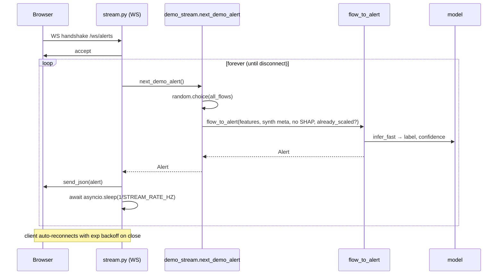

# 01 · Request Lifecycle

> The interviewer's favorite question is "walk me through what happens when…". This chapter is
> the answer for every important path. Learn the **generic skeleton** first, then the per-feature
> specifics.

---

## The generic skeleton (every REST request)

The template you were given lists: *User → Frontend → API Route → Middleware → Auth → Controller →
Service → Repository → Database → AI Service → Response → Frontend.*

Here is how this project maps onto it — including the layers that **don't exist** (say this out loud
in an interview, it shows you know what you skipped and why):

| Template layer | In this project? | What plays its role |
|----------------|------------------|---------------------|
| Frontend request | ✅ | `frontend/src/lib/api.ts` — thin `fetch`/`WebSocket` client |
| API Route | ✅ | FastAPI `APIRouter`s in `scripts/app/routers/` |
| Middleware | ✅ | CORS + a custom request-timing logger + a global exception handler ([api.py](../../scripts/api.py)) |
| **Authentication** | ❌ | **None.** Open API. See [07-Security.md](07-Security.md) for why & what you'd add |
| **Authorization** | ❌ | **None.** No roles, no per-resource checks |
| Controller | ✅ (merged) | FastAPI "path operation functions" *are* the controllers; they're thin and delegate immediately |
| Service | ✅ | `prediction_service`, `csv_loader`, `demo_stream`, `flow_to_alert` |
| **Repository** | ❌ | **None.** No DB rows to fetch. `model.py` is the closest analog: it "loads" artifacts once |
| **Database** | ❌ | **None.** Persistence = static model/scaler/label files. See [04](04-Data-and-Model-Store.md) |
| AI Service | ✅ | The Keras model + SHAP explainer, invoked through `prediction_service` |
| Response | ✅ | Pydantic models serialized to JSON (or WS frame) |

> **Why no controller/service/repository split into three?** With no database, a repository layer
> would be an empty pass-through — a classic **over-engineering anti-pattern**. The honest design
> is **router → service → model**. Three layers, each earning its keep.

---

## Cross-cutting concerns (run on *every* request)

These live in [scripts/api.py](../../scripts/api.py) and wrap all routes:

1. **CORS middleware** — rejects browser calls from origins not in `settings.CORS_ORIGINS`. Methods/headers are `*`; origins are an explicit allow-list (default includes `localhost:8080/5173`). In prod you add your Vercel URL via `NIDS_CORS_ORIGINS`.
2. **Request-timing logger** — `@app.middleware("http")` records `method path -> status (X.Xms)` for every request. This is your cheapest observability.
3. **Global exception handler** — `@app.exception_handler(Exception)` catches anything uncaught, logs the stack trace, and returns a generic `500 {"error": "Internal server error"}` so internal details never leak to the client.
4. **Startup lifespan** — *not per-request*, but it's why requests are fast: `load_models()` runs once before the server accepts traffic, so the first real request doesn't eat the multi-second TF load.

---

## Feature 1 — Fast prediction (`POST /predict`)

**Use case:** a machine client (or the dashboard) wants the label for one flow, as fast as possible.

**Key points to narrate:**
- Input may be a **dict** (`{"Flow Duration": ..., ...}`) *or* a **list** of 78 floats. `vectorize()` handles both; dicts get reordered to `FEATURE_NAMES`.
- Scaling happens **server-side** (`already_scaled=False`) — the client sends raw flow values, not pre-scaled ones. This keeps the client dumb and the contract honest.
- No SHAP → one forward pass → low latency.

---

## Feature 2 — Explained prediction (`POST /predict/explain`)

Same as above until after the forward pass, then it **also** runs SHAP:

**Why two endpoints instead of a flag?** Clearer contract (`PredictResponseFast` vs `PredictResponse`),
self-documenting in `/docs`, and the fast path never accidentally pays the SHAP cost. (A `?explain=true`
flag would also work — that's a legitimate alternative to mention.)

---

## Feature 3 — Batch CSV analysis (`POST /api/analyze`)

**Use case:** analyst uploads a CSV of many flows for offline triage; wants alerts + a summary.

**Narrate the safeguards:** row cap (`MAX_UPLOAD_ROWS=5000`), SHAP cap (`ANALYZE_SHAP_CAP=50`),
inf/NaN sanitization, and the fact that IPs/protocol are **synthesized** because the CICIDS feature
CSV doesn't carry them (they were dropped during preprocessing).

---

## Feature 4 — Live alert stream (`GET /ws/alerts`, WebSocket)

**The client side** ([api.ts](../../frontend/src/lib/api.ts) `connectAlertStream`): opens the socket,
on each message `normalizeAlert(JSON.parse(...))` (converts timestamp → `Date`, fills geo fallback),
and on close reconnects with `min(1000 * 2**retry, 15000)` ms backoff unless the caller closed it.

---

## Response lifecycle (the way back out)

1. Service returns a **Pydantic model** instance (e.g. `PredictResponse`).
2. FastAPI serializes it to JSON using the route's `response_model` — this also **filters** fields, so even if the object had extras, only declared fields ship.
3. The timing middleware logs `... -> 200 (X.Xms)` on the way out.
4. nginx (prod) forwards the bytes to the browser.
5. Frontend `api.ts` normalizes (e.g. `normalizeAlert`) and React renders.

> **WHAT IF something throws mid-service?** It bubbles to the global exception handler → logged with
> stack trace → client gets `500 {"error": "Internal server error"}`. Validation errors (wrong length,
> missing feature) are raised as `HTTPException(400, ...)` *inside* the service, so the client gets a
> specific 400 with a helpful message instead of a generic 500.
