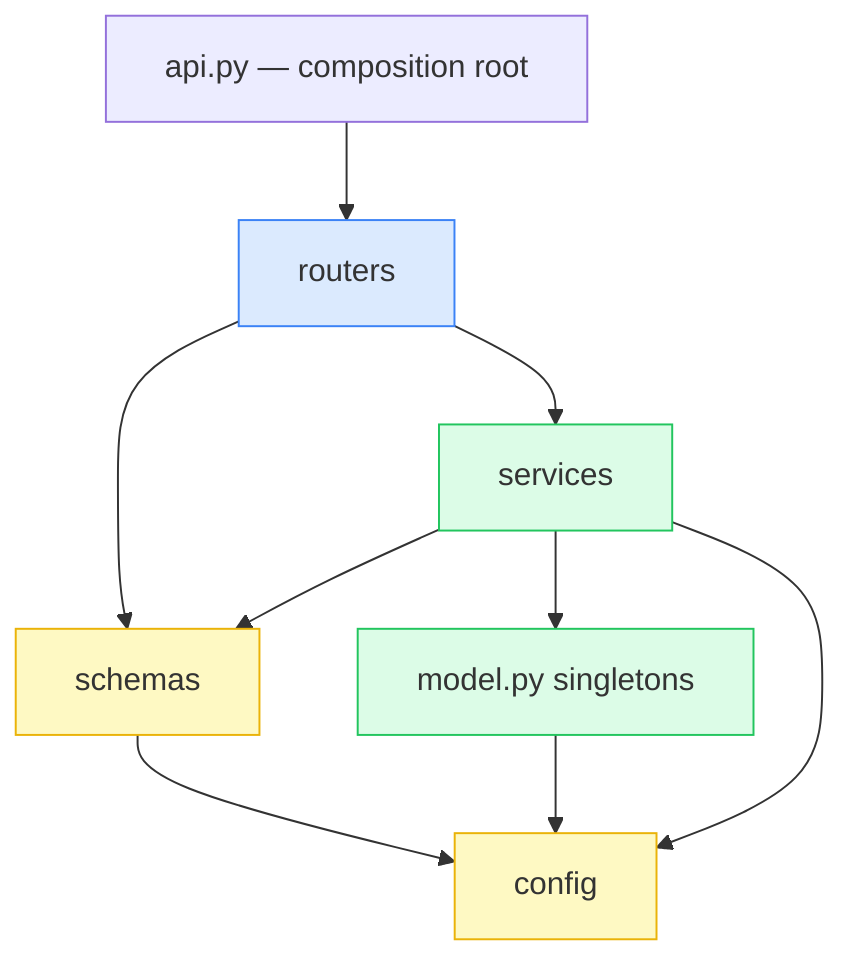

# 02 · Backend Architecture

> How the code is organized, why it's split that way, and the patterns (and anti-patterns avoided)
> you should be able to name.

---

## 1. Folder structure & responsibilities

```
scripts/
├── api.py                     # composition root: app, middleware, lifespan, router wiring
└── app/
    ├── config.py              # Settings: env-driven config, single source of paths/tunables
    ├── schemas.py             # Pydantic models = the API contract (input + output shapes)
    ├── routers/               # TRANSPORT layer (HTTP/WS). Thin. No ML logic.
    │   ├── health.py          #   GET /health, GET /features
    │   ├── predict.py         #   POST /predict, /predict/explain, /predict/batch
    │   ├── analyze.py         #   POST /api/analyze
    │   └── stream.py          #   WS /ws/alerts
    └── services/              # BUSINESS + ML layer. No FastAPI request objects leak in here*
        ├── model.py           #   singletons: scaler, model, explainer, FEATURE_NAMES, LABELS
        ├── prediction_service.py  # infer_fast / infer_explained / predict_* orchestration
        ├── flow_to_alert.py   #   maps a prediction → an Alert domain object
        ├── csv_loader.py      #   parse + validate uploaded CSV → list[dict]
        ├── demo_stream.py     #   sample real flows to feed the WebSocket
        ├── geoip.py           #   optional IP→lat/lng/city
        └── label_map.py       #   label → severity
```

\* *Small caveat:* `csv_loader` and `model.vectorize` raise `fastapi.HTTPException` and accept
`UploadFile`. That's a deliberate, pragmatic coupling (the validation error *is* an HTTP concern),
not an accident. A purist would raise a domain error and translate it in the router; for a project
this size, raising `HTTPException` inline is the right amount of ceremony.

---

## 2. The layered architecture & dependency flow



**Dependency direction is strictly downward:** routers depend on services; services depend on
`model.py` and `config`; nothing in `services/` imports from `routers/`. This is the
**Dependency Rule** — high-level transport code depends on lower-level business code, never the
reverse. It's why you can unit-test `vectorize`, `load_csv`, `to_severity` etc. with **no HTTP
server running** (see [tests/](../../tests/)).

### Why separate routers from services?

| If you merged them (put ML in the router)… | …you'd lose |
|---|---|
| `infer_fast` is called by `predict.py`, `analyze.py`, AND `demo_stream.py` | reuse — you'd duplicate the scale→predict→argmax logic 3× |
| Routers know about HTTP status codes & `UploadFile` | testability — you'd need a TestClient to test prediction math |
| | clarity — a 200-line router mixing parsing, validation, scaling, SHAP |

> **Interview line:** "The router answers *how the request arrives*; the service answers *what we do
> with it*. Keeping them apart let four entry points (single predict, explain, batch, WebSocket)
> share one inference core."

---

## 3. Key patterns used (name them precisely)

### a) Singleton (process-level) — `model.py`
The scaler loads at import time; the Keras model and SHAP explainer load once via `load_models()`
and live in module globals (`model`, `explainer`). Every request reuses them.
- **Why:** the model is read-only, expensive to construct (seconds, ~GB), and safe to call concurrently.
- **Thread-safety:** `load_models()` is idempotent (`if model is not None and explainer is not None: return`). TF `model.predict` is safe to call from multiple threads. (One subtle race: two threads calling `load_models()` simultaneously before startup could both load — but in practice `lifespan` loads it once, single-threaded, before any request. See [06](06-Services-and-Functions.md).)

### b) Lazy initialization + eager warm-up
Heavy imports (`tensorflow`, `shap`) are **inside** `load_models()`, not at module top. So importing
`model.py` for metadata (labels, feature names, scaler) is cheap and TF-free — which is exactly what
`health.py` and the tests need. Then `lifespan` *eagerly* calls `load_models()` so production never
pays the cost on a user request. **Lazy where it helps testing; eager where it helps latency.**

### c) Settings object / Configuration pattern — `config.py`
A single `Settings` instance reads `NIDS_*` env vars with typed helpers (`_env`, `_env_int`,
`_env_float`, `_env_list`) and sane defaults. Everything imports `settings`. No magic constants
scattered across files.

### d) DTO / Schema pattern — `schemas.py`
Pydantic models are the **contract**. `response_model=` on each route both validates *and* shapes
the output (extra fields are dropped). Request bodies are validated automatically → 422 on bad shape.

### e) Mapper / Adapter — `flow_to_alert.py`
Translates the ML world (numpy array + raw probabilities) into the **domain object** the frontend
speaks (`Alert` with `srcIP`, `severity`, `geo`, camelCase fields). Single place that owns that mapping.

### f) Strategy-ish fallbacks — `model.py` / `demo_stream.py`
The SHAP background and demo-stream source are chosen at import time from an ordered list of
candidates (real processed data → committed sample → synthetic). Not a formal Strategy pattern,
but the same spirit: pick an implementation based on the environment.

### Anti-patterns deliberately avoided

| Anti-pattern | How it was avoided |
|---|---|
| **God object** | Logic is split across small single-purpose services, not one `utils.py` |
| **Empty repository layer** | No DB → no pointless repository abstraction |
| **Loading model per request** | Singleton + lifespan warm-up |
| **Heavy import at module top** | TF/SHAP imported lazily inside `load_models()` |
| **Leaking internals on error** | Global handler returns generic 500; details only in logs |
| **Hardcoded config** | All tunables via `NIDS_*` env with defaults |

---

## 4. The composition root (`api.py`)

This is the only file that knows about *everything*. It:
1. Configures logging from `settings.LOG_LEVEL`.
2. Defines `lifespan` (load model on startup).
3. Creates the `FastAPI` app and attaches `lifespan`.
4. Adds CORS middleware (origins from settings).
5. Adds the request-timing middleware.
6. Registers the global exception handler.
7. `include_router(...)` for health, predict, stream, analyze.

This is the **Composition Root pattern**: wiring lives in exactly one place, so dependencies flow
out from a single, readable entry point. Everything else is a leaf that does one job.

---

## 5. Dependency Injection — is it used?

**Not the framework-DI kind** (no `Depends(...)` provider graph, no DI container). Instead it uses
**module-level singletons** imported directly. That's a legitimate, simpler form of DI for a
single-model service.

- **Tradeoff:** importing `model.py` has the *side effect* of loading the scaler. That's slightly
  less pure than injecting a scaler, but far less boilerplate.
- **If you wanted testability/mocking:** FastAPI's `Depends` could inject `get_model()`/`get_explainer()`
  so tests swap in a fake. The functions `get_model()`/`get_explainer()` already exist as seams —
  you could wrap them in `Depends` with ~5 lines. Mention this as the obvious next step if asked
  "how would you make this more testable / support multiple models?"

---

## 6. Configuration deep-dive (`config.py`)

| Setting | Env var | Default | Purpose |
|---|---|---|---|
| `MODEL_PATH` | `NIDS_MODEL_PATH` | `models/new/nids_model.h5` | Keras model file |
| `SCALER_PATH` | `NIDS_SCALER_PATH` | `models/new/cicids_scaler.pkl` | MinMaxScaler |
| `LABELS_PATH` | `NIDS_LABELS_PATH` | `models/new/class_labels.json` | labels + n_features |
| `BACKGROUND_PATH` | `NIDS_BACKGROUND_PATH` | `data/processed/X_dcnn.npy` | preferred SHAP background (usually absent) |
| `DEMO_FLOWS_PATH` | `NIDS_DEMO_FLOWS_PATH` | `data/demo_flows.npy` | committed fallback sample |
| `BACKGROUND_SIZE` | `NIDS_BACKGROUND_SIZE` | `100` | SHAP background row count |
| `TOP_K_DEFAULT` | `NIDS_TOP_K_DEFAULT` | `10` | default SHAP top-K returned |
| `GEOIP_DB_PATH` | `NIDS_GEOIP_DB_PATH` | `None` | MaxMind .mmdb; geo disabled if unset |
| `CORS_ORIGINS` | `NIDS_CORS_ORIGINS` | localhost:8080/5173 | allowed browser origins |
| `STREAM_RATE_HZ` | `NIDS_STREAM_RATE_HZ` | `1.0` | WS alerts per second |
| `MAX_UPLOAD_ROWS` | `NIDS_MAX_UPLOAD_ROWS` | `5000` | CSV row cap |
| `ANALYZE_SHAP_CAP` | `NIDS_ANALYZE_SHAP_CAP` | `50` | max flows that get SHAP in batch |
| `LOG_LEVEL` | `NIDS_LOG_LEVEL` | `INFO` | logging verbosity |

Note the **backward-compat shims** at the bottom of `config.py` (`MODEL_PATH = settings.MODEL_PATH`,
etc.) — kept so older `from .config import MODEL_PATH` imports still resolve. Small but worth noting:
it shows attention to not breaking existing imports during a refactor to the `Settings` object.

---

## 7. Request vs response shape (contract summary)

| Endpoint | Request model | Response model |
|---|---|---|
| `POST /predict` | `PredictRequest` | `PredictResponseFast` |
| `POST /predict/explain` | `PredictRequest` | `PredictResponse` |
| `POST /predict/batch` | `UploadFile` (CSV) | `PredictBatchResponse` |
| `POST /api/analyze` | `UploadFile` + `include_shap` form | `AnalyzeResponse` |
| `GET /ws/alerts` | — (WS) | `Alert` frames |
| `GET /health` | — | dict |
| `GET /features` | — | `{features: [...]}` |

See [03-API-Deep-Dive.md](03-API-Deep-Dive.md) for field-by-field detail.
