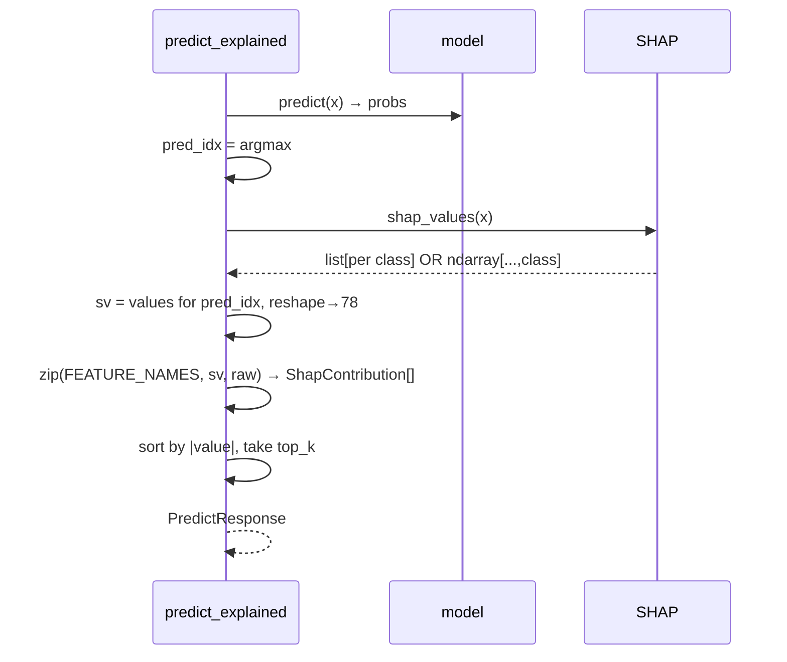

# 03 · API Deep Dive

> Every endpoint, field by field: purpose, request, response, validation, failure modes, edge cases,
> performance, and the interview questions that hide in each one.

Base URL: same-origin in prod (nginx proxies), or `http://localhost:8000` in dev.
Interactive docs: **`/docs`** (Swagger UI, auto-generated by FastAPI).

---

## Endpoint index

| Method | Path | Purpose | SHAP? | Auth |
|---|---|---|---|---|
| GET | `/health` | liveness + model metadata | — | none |
| GET | `/features` | the 78 feature names in model order | — | none |
| POST | `/predict` | fast single-flow classification | no | none |
| POST | `/predict/explain` | single-flow + probabilities + SHAP | yes | none |
| POST | `/predict/batch` | CSV → list of fast predictions | no | none |
| POST | `/api/analyze` | CSV → rich alerts + summary | optional | none |
| WS | `/ws/alerts` | live demo alert stream | no | none |

---

## `GET /health`

**Purpose:** liveness probe + tells a client what the model expects. Used by Docker `HEALTHCHECK`
and the frontend on load.

**Response**
```json
{ "status": "ok", "n_features": 78, "n_classes": 11,
  "labels": ["BENIGN","Botnet","DDoS", ...],
  "shap_background_size": 100 }
```
**Execution:** reads module-level constants from `model.py` (`N_FEATURES`, `LABELS`, `background.shape[0]`).
No model forward pass → instant. **Edge case:** if `model.py` failed to import (bad scaler/labels file),
the whole app fails to start, so a reachable `/health` already implies metadata loaded.

**Interview Q:** *Why expose feature/class counts on a health endpoint?* → Lets clients validate they're
sending the right input width and discover labels without hardcoding — self-describing API.

---

## `GET /features`

**Purpose:** returns `{"features": [...78 names...]}` in the exact order the model/scaler expect.
**Why it matters:** a client building a feature dict can confirm names; the order is the contract.
Source of truth is `scaler.feature_names_in_`.

---

## `POST /predict`  (fast path)

**Request** (`PredictRequest`):
```json
{ "features": {"Flow Duration": 1200, "Total Fwd Packets": 5, ...},  // OR a list[78] of floats
  "top_k": 10 }   // ignored on this endpoint (no SHAP)
```
**Response** (`PredictResponseFast`):
```json
{ "predicted_class": "DDoS", "predicted_index": 2, "confidence": 0.9997 }
```

**Validation chain**
1. Pydantic checks `features` is `dict[str,float] | list[float]`.
2. `vectorize()`:
   - list → must be length 78, else `HTTPException(400, "Expected 78 feature values, got N")`.
   - dict → every name in `FEATURE_NAMES` must be present, else `400 Missing features: [...]`.

**Execution flow:** `vectorize → scaler.transform → reshape(1,78,1) → model.predict → argmax`.
**External calls:** none. **AI calls:** 1 forward pass. **DB:** none.

**Failure modes**
| Cause | Result |
|---|---|
| wrong list length | 400 with count |
| missing dict keys | 400 listing first 5 missing |
| non-numeric value | Pydantic 422 (can't coerce to float) |
| model not loaded | `get_model()` lazy-loads it (shouldn't happen post-lifespan) |

**Performance:** dominated by a single TF forward pass on a `(1,78,1)` tensor — milliseconds on CPU
after warm-up. **Scalability:** CPU-bound; scale horizontally (more replicas) or batch (see `/predict/batch`).

**Edge case worth knowing:** the client sends **raw** (unscaled) values; scaling is server-side. If a
client mistakenly pre-scales, predictions silently degrade — there's no guard for "already in [0,1]".

---

## `POST /predict/explain`  (explainable path)

**Response** (`PredictResponse`):
```json
{ "predicted_class": "DDoS", "predicted_index": 2, "confidence": 0.9997,
  "probabilities": {"BENIGN":0.0001, "DDoS":0.9997, ...},   // all 11
  "top_contributions": [ {"feature":"Flow Duration","value":0.12,"raw_input":1200}, ... ],  // top_k by |value|
  "all_contributions": [ ...78... ] }
```

**Extra work vs fast path:** after the forward pass, `explainer.shap_values(x)` computes per-feature
attributions for the predicted class; `predict_explained` builds 78 `ShapContribution`s, sorts by
`abs(value)` desc, slices `top_k` (≥1).



**Subtlety (shape handling):** SHAP returns either a `list` (one array per class) or a single ndarray
with class on the last axis. `infer_explained` handles both:
```python
if isinstance(shap_values, list):
    sv = np.asarray(shap_values[pred_idx])
else:
    sv = np.asarray(shap_values)[..., pred_idx]
```
This is **defensive coding** against SHAP version differences — a great detail to point out.

**Performance:** much slower than `/predict` (gradient passes). That's *why* it's a separate endpoint
and why batch analysis caps SHAP.

**Interview Q:** *What does a SHAP value mean here?* → The signed contribution of that feature to the
model's output for the predicted class, relative to the background distribution. Positive = pushed the
score toward this class; magnitude = how much. We sort by **absolute** value because the most
*influential* features matter regardless of direction.

---

## `POST /predict/batch`

**Request:** multipart CSV upload (field name `csv`).
**Response** (`PredictBatchResponse`): `{ "flow_result": [ {predicted_class, predicted_index, confidence}, ... ] }`.

**Flow:** `load_csv(csv)` → `list[dict]` → wrapped in `PredictBatchRequest` → `predict_batch` runs
`predict_fast` per row.

**Edge cases / honest critiques:**
- `predict_batch` loops Python-side, one `model.predict` per row — **not vectorized**. For large CSVs
  this is slower than batching all rows into one `(N,78,1)` tensor. (See [11-Improvements.md](11-Improvements.md): batched inference is the #1 quick win.)
- Row cap `MAX_UPLOAD_ROWS=5000` bounds the cost.
- No SHAP here — it's the bulk/fast batch path. `/api/analyze` is the rich one.

---

## `POST /api/analyze`  (the dashboard's batch endpoint)

**Request:** multipart `csv` + form field `include_shap: bool=False`.
**Response** (`AnalyzeResponse`): `{ alerts: Alert[], summary: {total, benign, malicious, by_class} }`.

**Per-row pipeline** ([analyze.py](../../scripts/app/routers/analyze.py)):
1. Build the 78-vector from the row in `FEATURE_NAMES` order.
2. `synth_meta(row)` → fake src/dst IP + protocol (CSV has no IPs).
3. SHAP only if `include_shap and shap_used < ANALYZE_SHAP_CAP` (default 50) — then increment counter.
4. `flow_to_alert(...)` → `Alert` (label, severity, confidence, geo if non-BENIGN, optional shapValues).
5. Tally `by_class` and `malicious`.

**Summary math:** `benign = total - malicious`; `malicious = count(type != "BENIGN")`.

**Why cap SHAP at 50?** SHAP is the bottleneck; capping bounds latency on a 5000-row upload while
still giving analysts explanations for the first/most-recent flows. Tunable via `NIDS_ANALYZE_SHAP_CAP`.

**Failure modes:** all `load_csv` failures (empty, missing columns, too many rows, parse error) surface
as `400` with a message. nginx allows up to `64m` upload and `300s` read timeout for slow SHAP runs.

---

## `GET /ws/alerts`  (WebSocket)

**Purpose:** push a synthetic-but-model-driven `Alert` to the dashboard every `1/STREAM_RATE_HZ`
seconds. This is the "live monitoring" demo.

**Server loop** ([stream.py](../../scripts/app/routers/stream.py)):
```python
await ws.accept()
while True:
    alert = next_demo_alert()            # sample a real flow → classify → Alert
    await ws.send_json(alert.model_dump(mode="json"))
    await asyncio.sleep(STREAM_INTERVAL) # 1.0s by default
# WebSocketDisconnect → return
```

**Where the flows come from** ([demo_stream.py](../../scripts/app/services/demo_stream.py)): at import,
it tries to **reservoir-sample** 200 rows from each of 3 raw CICIDS CSVs. If those aren't present
(the usual deploy case), it falls back to `demo_flows.npy` (already-scaled real flows), else to the
SHAP background. `FLOWS_ALREADY_SCALED` tracks which, so `flow_to_alert` knows whether to scale.

**Edge cases:**
- Each frame uses **synthetic** src/dst IP & protocol (display only).
- No SHAP in the stream (keeps it cheap at 1 Hz).
- `STREAM_RATE_HZ <= 0` → defaults interval to 1.0s (guard in `stream.py`).
- One blocking `model.predict` per tick runs inside the async loop — fine at 1 Hz / few clients;
  at high fan-out you'd offload to a threadpool or precompute. (Discussed in [08](08-Performance-and-Scalability.md).)

**Client resilience:** `connectAlertStream` reconnects with exponential backoff (cap 15 s) and
de-dupes "closed by caller" so navigating away doesn't trigger a reconnect storm.

---

## Cross-endpoint concerns

### Validation summary
| Layer | Catches |
|---|---|
| Pydantic request models | wrong types, missing required fields → **422** |
| `vectorize()` | wrong feature count / missing names → **400** |
| `load_csv()` | empty, missing columns, too many rows, parse error → **400** |
| global handler | anything else → **500 generic** |

### Error contract
- **400** = your input is wrong, here's why (specific message).
- **422** = your JSON shape is wrong (Pydantic detail).
- **500** = our fault, generic message, details in server logs only.

### Authentication / Authorization
**None on any endpoint.** Every route is public. This is acceptable for a demo/research tool but is
the #1 thing to add for production — see [07-Security.md](07-Security.md).

---

## Per-endpoint interview questions (quick fire)

1. *Why is `/predict` separate from `/predict/explain`?* — cost isolation + clearer contract.
2. *What happens if I POST 77 features?* — `vectorize` raises `HTTPException(400, "Expected 78...")`.
3. *Why synthesize IPs in `/api/analyze`?* — the CICIDS feature CSV dropped IP/timestamp columns in preprocessing; they're display-only.
4. *Why cap SHAP in batch but not rows?* — rows are also capped (`MAX_UPLOAD_ROWS`); SHAP is capped separately because it's the dominant cost.
5. *How do you stream without polling?* — WebSocket; server pushes; client reconnects with backoff.
6. *Is the batch endpoint efficient?* — honestly no, it loops per-row; batching into one tensor is the obvious optimization.
7. *What stops a 1 GB CSV from OOMing you?* — `MAX_UPLOAD_ROWS` (count) + nginx `client_max_body_size 64m` (bytes). (Note: `pd.read_csv` still buffers the upload first — a streaming/early-abort parser would be stricter.)
