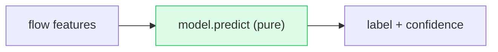

# 04 · Data & Model Store (the "Database" chapter)

> The template asks for tables, columns, indexes, foreign keys, transactions, migrations. **This
> project has no database.** That is a *design decision*, not an omission — and explaining it well
> is worth more than reciting normal-forms. This chapter covers (a) why there's no DB, (b) what
> actually serves as persistent state, and (c) how you'd add a DB if requirements changed.

---

## 1. Why there is no database

> A NIDS *inference service* is a **pure function**: `predict(flow_features) → label`. The output
> depends only on the input and the (read-only) trained model. There is no user data to store, no
> mutable state to keep consistent, no transactions to coordinate. Adding Postgres/Mongo would be
> **infrastructure with no purpose** — an anti-pattern (accidental complexity).



**WHEN would that change?** The moment you need to *persist* anything across requests:
- store every alert for audit/history → a DB
- let analysts mark alerts true/false-positive → a DB (mutable state)
- track per-API-key usage/quotas → a DB or Redis
- collect flows to retrain on → object storage + a metadata DB

See §5 for the schema you'd design then.

---

## 2. What actually serves as "persistent state"

The system's durable state is a handful of **artifact files** loaded at startup. Think of these as a
read-only, in-memory "database" whose "rows" are model weights and lookup tables.

| Artifact | File | Loaded by | Role (DB analogy) |
|---|---|---|---|
| **Trained model** | `models/new/nids_model.h5` | `model.load_models()` | the "stored procedure" that computes predictions |
| **Feature scaler** | `models/new/cicids_scaler.pkl` | `model.py` (import time) | normalization params + **`feature_names_in_`** (the schema/column order) |
| **Label metadata** | `models/new/class_labels.json` | `model.py` | the enum table: index → class name, `n_features`, `n_classes` |
| **SHAP background** | `data/processed/X_dcnn.npy` → `data/demo_flows.npy` → synthetic | `model.py` | reference distribution for explanations |
| **Demo flows** | `data/demo_flows.npy` | `demo_stream.py` | seed data for the live stream |
| **GeoIP DB** (optional) | MaxMind `GeoLite2-City.mmdb` | `geoip.py` | a real read-only lookup database (B-tree over IP ranges) |
| **TFLite model** | `models/new/nids_model.tflite` | (not served by the API) | edge/quantized export |

> **Interview gold:** "The scaler's `feature_names_in_` *is* my schema. It pins the 78-column order
> the model was trained on, and every input path reorders to it. That's how a stateless service still
> enforces a strict data contract."

### In-memory runtime state (not persisted)
- `model`, `explainer`, `scaler`, `background`, `LABELS`, `FEATURE_NAMES`, `N_FEATURES` — module globals in `model.py`.
- `all_flows` — the sampled demo flows in `demo_stream.py`.
- `geoip.lookup` — an **`@lru_cache(maxsize=10000)`** memo of IP→geo (the closest thing to a cache/index here).

All of this is **per-process** and rebuilt on restart. Two replicas don't share it and don't need to.

---

## 3. The real "data design" that matters here: the feature schema

Even without tables, there's a strict data contract — the **78 CICFlowMeter features**. These are the
columns the model consumes. They're produced offline by `preprocessing.py` and pinned by the scaler.

**Why these 78 and not the raw packets?** CICIDS2017 ships flows already summarized by CICFlowMeter:
flow duration, total/forward/backward packet counts, packet-length stats (min/max/mean/std), byte
rates, inter-arrival times (IAT), TCP flag counts, active/idle times, etc. The model learns on these
**engineered aggregates**, which is why it generalizes across attack families.

**Columns dropped on purpose** (`preprocessing.py`): `Flow ID, Source IP, Destination IP, Timestamp`.
- They're identifiers, not signal — keeping them would let the model "cheat" (memorize IPs) and hurt generalization.
- *Consequence at serve time:* the API has no real IPs, so `synth_meta`/`demo_stream` **fabricate** them for display. That's why your alerts show random public IPs.

**Data types:** every feature is a float (after `pd.to_numeric`). The model input tensor is `float32`,
shape `(batch, 78, 1)` — the trailing `1` is the single "channel" the Conv1D slides over.

---

## 4. Query patterns & "read vs write" (mapped to this system)

| RDBMS concept | Equivalent here |
|---|---|
| Read query | a forward pass: `model.predict(x)` |
| Write/insert | **none** at serve time; "writes" happen offline when you retrain & re-export artifacts |
| Index | `geoip` LRU cache; the MaxMind DB's internal IP B-tree; (model itself is the "materialized" answer) |
| Transaction | **N/A** — no multi-step mutations to make atomic |
| Migration | **artifact versioning**: retrain → new `.h5` + `.pkl` + `class_labels.json`, swap the files. The model dir (`old/` vs `new/`) *is* the migration history |
| Read replica | a second stateless container (model is read-only → trivially replicable) |

### "Migration strategy" without a schema migration tool
Because the persistent state is files, a model "migration" is: **train → export the trio
(`model.h5`, `scaler.pkl`, `class_labels.json`) together → deploy them together.** They must move as
a set — a model with a mismatched scaler or label list produces silent garbage. The repo's
`models/old/` and `models/new/` directories are effectively v1 and v2.

> **Common mistake to call out:** swapping `nids_model.h5` alone without its matching `cicids_scaler.pkl`
> and `class_labels.json`. The boot-time check `len(FEATURE_NAMES) == N_FEATURES` catches *width*
> mismatches, but **not** a scaler fit on a different feature ordering/distribution. Always ship the trio.

---

## 5. If you DID add a database — the schema you'd design

Say the product now needs alert history + analyst feedback + API keys. A sensible relational design
(PostgreSQL):

```mermaid
erDiagram
    API_KEY ||--o{ ANALYSIS_RUN : "authenticates"
    ANALYSIS_RUN ||--o{ ALERT : "produces"
    ALERT ||--o{ SHAP_CONTRIB : "explained by"
    ALERT ||--o| FEEDBACK : "labeled by analyst"
    MODEL_VERSION ||--o{ ALERT : "scored by"

    API_KEY { uuid id PK; text hash; text owner; timestamptz created_at; bool active }
    ANALYSIS_RUN { uuid id PK; uuid api_key_id FK; text source; int total; int malicious; timestamptz created_at }
    ALERT { uuid id PK; uuid run_id FK; uuid model_version_id FK; text type; text severity; float confidence; inet src_ip; inet dst_ip; text protocol; bigint flow_duration; int fwd_packets; timestamptz ts }
    SHAP_CONTRIB { uuid id PK; uuid alert_id FK; text feature; float value; float raw_input }
    FEEDBACK { uuid id PK; uuid alert_id FK; bool is_true_positive; text analyst; timestamptz ts }
    MODEL_VERSION { uuid id PK; text path; text scaler_path; int n_features; int n_classes; timestamptz trained_at }
```

**Indexes you'd add & why:**
- `ALERT(ts)` — time-range queries for the dashboard ("last 24 h").
- `ALERT(type)` / `ALERT(severity)` — filter by attack family / severity.
- `ALERT(run_id)` — fetch all alerts of an upload.
- `ALERT(src_ip)` (GiST/inet) — "all alerts from this IP."
- partial index `ALERT(ts) WHERE type <> 'BENIGN'` — most queries only care about attacks.

**Write vs read optimization:** alerts are **write-heavy, append-only** → batch inserts (`COPY`),
partition by day/time, never `UPDATE`. Reads are dashboards → time + type indexes + maybe a rollup
table (`hourly_counts_by_class`) so the summary view doesn't scan raw alerts.

**Why Postgres over Mongo here?** Alerts are uniform, relational (alert→run→key→model), and you want
analytical filters/aggregations → SQL wins. You'd reach for a **time-series DB** (Timescale/Clickhouse)
if alert volume hit millions/day. Mongo would only win if alert schemas were wildly heterogeneous,
which they aren't.

**SHAP storage:** store contributions as rows (`SHAP_CONTRIB`) *or* a JSONB column on `ALERT` if you
never query individual features. JSONB is simpler; normalized rows let you ask "which features most
often drive DDoS calls?"

---

## 6. Scaling the data layer (forward reference)

Stateless serving means the **model layer scales by cloning**. The moment a DB exists, *it* becomes
the stateful bottleneck and the scaling story shifts to read replicas, partitioning, and caching —
covered in [08-Performance-and-Scalability.md](08-Performance-and-Scalability.md).

---

## Interview questions for this chapter

1. *Your project has no database — is that a weakness?* → No; it's a stateless inference service, a pure function of input + read-only model. Adding a DB without a persistence requirement is accidental complexity. I can describe exactly when I'd add one.
2. *Where's your schema then?* → The scaler's `feature_names_in_` pins the 78-column contract; `class_labels.json` is the label enum. Every input path reorders to that schema.
3. *How do you "migrate" the model?* → Train and export the `(model, scaler, labels)` trio together and deploy as a set; `old/` vs `new/` dirs are the versions. A width-mismatch assertion guards boot.
4. *If you stored alerts, SQL or NoSQL?* → Postgres: uniform, relational, analytical filters; partition append-only alerts by time; Timescale/Clickhouse if volume explodes.
5. *What indexes would you add and why?* → time, type, severity, src_ip, run_id, plus a partial index excluding BENIGN — driven by the dashboard's query patterns.
6. *Why drop Source IP during training?* → it's an identifier, not signal; keeping it invites memorization and hurts generalization — so the live API has to synthesize IPs for display.
