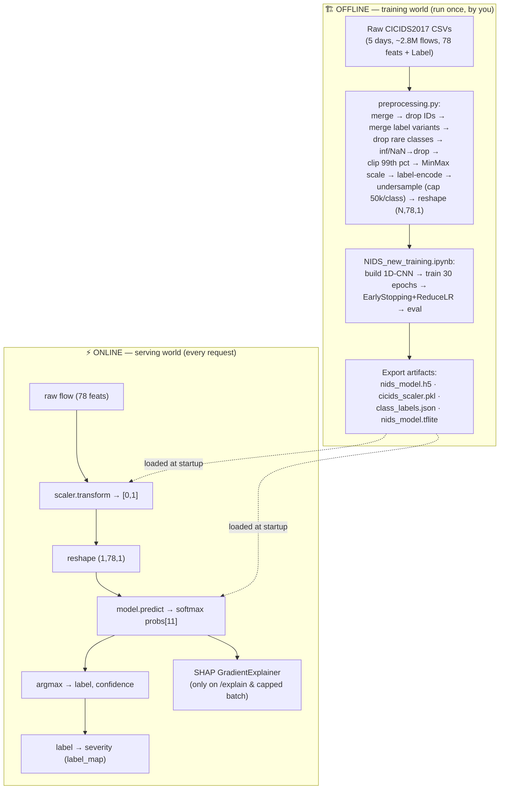

# 05 · AI / ML Pipeline (the heart of the project)

> This is where you earn the "AI/ML Engineer" title. Read it until you can draw the whole pipeline
> from memory and defend every hyperparameter.

> ⚠️ **Set expectations correctly in interviews.** This is **supervised deep learning** for tabular
> classification + **post-hoc explainability (SHAP)**. It is **not** generative AI: there is **no LLM,
> no RAG, no embeddings, no vector database, no prompt engineering**. If an interviewer asks about
> those, say so plainly and pivot to what this *does* use. (A "RAG analogy" mapping is in §11 for fun,
> but don't claim the project has RAG.)

---

## 1. The full pipeline, end to end



---

## 2. The dataset — CICIDS2017

- **Source:** Canadian Institute for Cybersecurity. Realistic 5-day capture, benign + modern attacks.
- **Features:** 78 flow statistics from **CICFlowMeter** (durations, packet/byte counts & rates, IAT stats, TCP flags, active/idle times…).
- **Why this dataset:** modern, labelled, widely benchmarked; fixes the staleness of KDD'99/NSL-KDD.
- **Classes after cleaning:** 11 → `BENIGN, Botnet, DDoS, DoS GoldenEye, DoS Hulk, DoS Slowhttptest, DoS slowloris, FTP-Patator, PortScan, SSH-Patator, Web Attacks`.

**Class imbalance is the central data challenge.** BENIGN and DDoS/Hulk/PortScan have hundreds of
thousands of flows; Botnet/Web-Attacks have only hundreds. Two techniques address it (below).

---

## 3. Preprocessing (`scripts/preprocessing.py`) — step by step

| # | Step | Code | WHY |
|---|------|------|-----|
| 1 | **Merge days** | `pd.concat(glob('../data/raw/*.csv'))` | one training table |
| 2 | **Strip column whitespace** | `df.columns.str.strip()` | CICIDS headers have stray spaces; must match later |
| 3 | **Drop identifiers** | drop `Flow ID, Source IP, Destination IP, Timestamp` | prevent memorization/leakage; keep only behavioral signal |
| 4 | **Merge label variants** | `Web Attack – Brute Force/XSS/Sql → "Web Attacks"`, `Bot → Botnet` | collapse sparse sub-labels into coherent families |
| 5 | **Drop rare classes** | `< 100 samples` removed | too few to learn or evaluate reliably |
| 6 | **Handle inf/NaN** | `replace(±inf→NaN).dropna()` | rates like `Flow Bytes/s` divide by zero → inf; models can't train on them |
| 7 | **Clip outliers** | `clip(upper = 99th percentile)` per feature | heavy-tailed flow stats; clipping stabilizes scaling & training |
| 8 | **Scale** | `MinMaxScaler` → [0,1] | CNN/grad-based training needs bounded, comparable feature ranges |
| 9 | **Encode labels** | `LabelEncoder` → 0..10 | model needs integer targets (used with sparse CCE) |
| 10 | **Undersample** | `RandomUnderSampler(cap 50k/class)` | tame the majority classes so the model doesn't ignore minorities |
| 11 | **Reshape** | `X.reshape(-1, 78, 1)` | Conv1D expects `(samples, steps, channels)` |
| 12 | **Save** | `X_dcnn.npy, y_labels.npy, cicids_scaler.pkl, class_mapping.json` | artifacts for training + serving |

> **Order matters:** scaling is fit **after** clipping and inf/NaN removal, **before** undersampling,
> and the scaler is fit on the **train distribution**. The exact same scaler object is then used at
> serve time — guaranteeing train/serve consistency (no train/serve skew).

### Two imbalance levers — know the difference
- **Undersampling (data level):** cap majority classes at 50k so gradients aren't dominated by BENIGN/Hulk. Cheap, but throws away majority data.
- *(Alternative the code doesn't use:)* **class weights** (loss level) or **oversampling/SMOTE**. Undersampling was chosen because the majority classes still have 50k examples — plenty — and it speeds up training. Mention class weighting as the alternative if asked about the rare-class recall (Botnet recall is the weakest at 77.75%).

---

## 4. The model — 1D Deep CNN (`build_model`)

```python
Sequential([
    InputLayer(input_shape=(78, 1)),
    Conv1D(128, 3, activation="relu", padding="same"), BatchNormalization(), MaxPooling1D(2),
    Conv1D(256, 3, activation="relu", padding="same"), BatchNormalization(), MaxPooling1D(2),
    Conv1D(256, 3, activation="relu", padding="same"), BatchNormalization(),
    Flatten(),
    Dense(512, activation="relu"), Dropout(0.3),
    Dense(256, activation="relu"), Dropout(0.2),
    Dense(11, activation="softmax"),
])
model.compile(optimizer=Adam(1e-4), loss="sparse_categorical_crossentropy", metrics=["accuracy"])
```

### Layer-by-layer reasoning

| Layer | Why it's there |
|---|---|
| **Input (78,1)** | each flow is a length-78 sequence with 1 channel |
| **Conv1D(128, k=3, same)** | learns local patterns across *adjacent* features (3-feature windows); 128 filters = 128 learned pattern detectors; `same` padding keeps length 78 |
| **BatchNorm** | normalizes activations → faster, more stable training; mild regularization |
| **MaxPool1D(2)** | downsamples by 2 → 39 → fewer params, translation tolerance |
| **Conv1D(256) → Pool → Conv1D(256)** | deeper = higher-level feature combinations; channels grow as spatial length shrinks (classic CNN funnel) |
| **Flatten** | turn feature maps into a vector for the dense head |
| **Dense(512)→Dropout(0.3)→Dense(256)→Dropout(0.2)** | the classifier head; dropout fights overfitting |
| **Dense(11, softmax)** | 11-way probability distribution |

**Optimizer/loss:**
- `Adam(lr=1e-4)` — adaptive, robust default; small LR for stable convergence.
- `sparse_categorical_crossentropy` — multi-class loss with **integer** labels (no one-hot needed → less memory). Pairs with the softmax output.

> ⚠️ **Subtle "why 1D and not 2D conv?"** Flow features are a 1D ordered vector, not a 2D image. 1D
> convolution slides over the feature axis; there's no spatial height/width to exploit. (The ordering
> isn't semantically deep — CICFlowMeter's column order — but neighboring stats are often related,
> e.g. fwd/bwd packet-length min/max/mean/std cluster together, which 1D kernels can pick up.)

### Training setup
- `EPOCHS=30`, `BATCH_SIZE=256`, `SEED=42` (numpy + TF seeded for reproducibility).
- **Split:** stratified `train_test_split` → 80% train / 20% test, then 10% of train → validation. Stratify preserves class ratios in each split.
- **Callbacks:**
  - `EarlyStopping(monitor=val_loss, patience=5, restore_best_weights=True)` — stop when val loss stalls, roll back to the best epoch (prevents overfitting, saves compute).
  - `ReduceLROnPlateau(factor=0.5, patience=3)` — halve LR when val loss plateaus (fine-grained convergence).

---

## 5. Results (from `scripts/EVAL_REPORT.md`)

| Metric | Value |
|---|---|
| Accuracy | **99.48%** |
| Macro F1 | **97.67%** |
| Weighted F1 | **99.47%** |
| Macro Precision | 98.29% |
| Macro Recall | 97.20% |

**Read the macro-vs-weighted gap correctly:** weighted ≈ accuracy (dominated by big classes);
macro is lower because **small classes drag it down**. The two weakest:
- **Botnet:** recall 77.75% — 87 of 391 botnet flows misclassified as BENIGN (confusion matrix row 1). Botnet traffic *looks* benign; this is the hardest class.
- **Web Attacks:** F1 93.44% — confused with SSH-Patator (21 flows) and benign.

> **Interview move:** never just say "99.48% accuracy." Say "99.48% accuracy but I look at **macro-F1
> (97.67%)** because of class imbalance, and the real weakness is **Botnet recall (77.75%)** — botnet
> flows mimic benign traffic. I'd fix it with class weighting / focal loss / targeted oversampling."
> That single answer signals senior ML judgment.

**Why accuracy alone is misleading:** a model predicting BENIGN for everything would still score well
on a benign-heavy set. Macro-F1 and per-class recall are the honest metrics for imbalanced security data.

---

## 6. Serving the model (`prediction_service.py` + `model.py`)

### Input transform (`_to_model_input`)
```python
if already_scaled: x = raw.reshape(1,78,1)
else:              x = scaler.transform(raw.reshape(1,78)).reshape(1,78,1)
```
- `already_scaled=True` is used by the demo stream when flows come from `demo_flows.npy` (already in [0,1]) — avoids double-scaling.
- Everything else (API inputs, CSV uploads) is raw → scaled server-side. **This is the single most
  important correctness invariant:** serve-time scaling uses the *exact* training scaler.

### `infer_fast` vs `infer_explained`
| | `infer_fast` | `infer_explained` |
|---|---|---|
| forward pass | 1 | 1 |
| SHAP | no | yes (`explainer.shap_values`) |
| returns | label, idx, conf, probs | + 78 contributions |
| cost | ~ms | much higher |

---

## 7. Explainability — SHAP `GradientExplainer`

**What SHAP gives you:** for one prediction, a signed contribution per feature explaining how much
each pushed the model toward the predicted class, relative to a **background** distribution.

**Why `GradientExplainer` specifically?**
- It's designed for **differentiable models** (neural nets) — uses gradients (expected-gradients/
  integrated-gradients flavor), far cheaper than `KernelExplainer` (which is model-agnostic but does
  thousands of perturbed forward passes).
- Tradeoff: needs gradient access (fine, it's Keras) and a representative background sample.

**The background** (`model.py`): 100 rows (`BACKGROUND_SIZE`) sampled with a seeded RNG from, in order
of preference: real processed data → committed `demo_flows.npy` → synthetic random [0,1]. Background =
the "baseline" SHAP compares against; quality matters for explanation fidelity (synthetic background →
explanations are directionally right but less faithful — noted honestly in `DEPLOYMENT.md`).

**Output handling** (version-robust): SHAP may return a list-per-class or a stacked ndarray;
`infer_explained` handles both, selects the predicted class's values, reshapes to 78, and
`predict_explained` sorts by `|value|` and returns `top_k`.

> **Hallucination/guardrails note (be precise):** "hallucination" is an LLM concept and doesn't apply
> to a softmax classifier. The analogous risk here is **overconfident wrong predictions** on
> out-of-distribution traffic. There's no confidence-threshold guard in the code — a great improvement
> to propose: reject/flag predictions below a confidence floor, or add an OOD/anomaly score.

---

## 8. TFLite export (`convert_to_tflite.py`)

Converts the H5 model to **TensorFlow Lite** with optional quantization:
- `fp16` — half-precision weights (~2× smaller, tiny accuracy hit).
- `int8` — full integer quantization using a representative dataset generator (~4× smaller, fastest on edge, needs calibration).
- `dynamic` — dynamic-range quantization (weights int8, activations float at runtime).
- default — full FP32.

It also **verifies** the converted model (loads the interpreter, runs a random input, prints I/O shapes).
**Why TFLite?** deploy on resource-constrained / edge devices (a sensor box on the network). Not used
by the FastAPI server (which loads the H5), but a meaningful "we thought about edge deployment" signal.

> Heads-up: the paths inside `convert_to_tflite.py` (`models/nids_dcnn_model.h5`) point at the **old**
> model layout; for the `new/` model you'd pass updated paths. Minor, but know it if asked to run it.

---

## 9. Severity mapping (`label_map.py`)

Pure lookup turning a class into an operational priority for the SOC:

| Severity | Classes |
|---|---|
| critical | DDoS, DoS GoldenEye, DoS Hulk |
| high | DoS Slowhttptest, DoS slowloris, FTP-Patator, SSH-Patator |
| medium | Botnet, PortScan, Web Attacks |
| low | BENIGN (and any unknown label → default low) |

**WHY this is separate from the model:** severity is a *business/operational* decision, not a model
output. Keeping it in a tiny pure function (`to_severity`) means a security team can re-prioritize
without retraining. Unknown labels default to `low` — a safe, explicit fallback.

---

## 10. Hyperparameter & decision cheat sheet

| Knob | Value | Rationale | Alternative |
|---|---|---|---|
| Architecture | 1D-CNN | local feature interactions, cheap, strong on CICIDS | XGBoost (often as good on tabular, faster), MLP, TabTransformer |
| Conv filters | 128→256→256 | funnel; enough capacity for 11 classes | fewer for speed/edge |
| Kernel size | 3 | small local windows | 5/7 for wider context |
| Optimizer | Adam 1e-4 | stable default | SGD+momentum, cosine schedule |
| Loss | sparse CCE | int labels, multi-class | focal loss for imbalance |
| Scaler | MinMax [0,1] | bounded inputs for NN | StandardScaler, RobustScaler |
| Imbalance | undersample 50k cap | simple, fast, classes still large | class weights, SMOTE |
| Outliers | clip 99th pct | tame heavy tails | winsorize, log-transform |
| Explainer | SHAP GradientExplainer | cheap for NNs, faithful | KernelSHAP (slow), Integrated Gradients, LIME |
| Export | TFLite (+quant) | edge deployment | ONNX, TF-Serving |

---

## 11. (Optional) "How is this like RAG?" — analogy only, NOT a claim

If an interviewer insists on a RAG framing, you can *map* concepts to show you understand RAG — but be
explicit it's an analogy:

| RAG concept | Loose analog here | Honest difference |
|---|---|---|
| Embedding | MinMax-scaled 78-vector | hand-engineered features, not learned embeddings |
| Vector DB / retrieval | SHAP **background** sample | used as a baseline, not retrieved per-query for context |
| LLM generation | softmax classification | discriminative, fixed label set, no generation |
| Prompt | the feature vector | no natural language, no template |
| Grounding/citations | SHAP attributions | explains *the model*, doesn't cite documents |

**Bottom line:** this project has none of RAG's components. Don't oversell it; the CNN+SHAP story is
strong on its own.

---

## Interview questions for this chapter

1. *Why a 1D CNN over XGBoost for tabular data?* — Honest answer: XGBoost is often equally good and faster on tabular; the CNN was chosen to learn local feature interactions and follows the CICIDS deep-learning literature. I'd benchmark both.
2. *How did you handle class imbalance?* — RandomUnderSampler capping majority classes at 50k; I monitor macro-F1 and per-class recall; Botnet recall (77.75%) is the weak spot I'd target with class weights/focal loss.
3. *Why MinMax not StandardScaler?* — bounded [0,1] inputs suit the NN and the clipped, non-Gaussian flow features; the same fitted scaler is reused at serve time to avoid train/serve skew.
4. *What does a SHAP value represent and why GradientExplainer?* — signed per-feature contribution vs a background baseline; GradientExplainer uses gradients (cheap for NNs) vs KernelSHAP's many perturbations.
5. *Your model is 99.48% accurate — convince me it's not overfit/leaking.* — stratified held-out test (47,912 flows), EarlyStopping on val loss, dropped IP/timestamp to prevent leakage, report per-class metrics not just accuracy.
6. *Why reshape to (78,1)?* — Conv1D needs `(steps, channels)`; one channel.
7. *What's the risk at serve time on weird traffic?* — overconfident OOD predictions; no confidence threshold today; I'd add one + an anomaly score.
8. *Why export TFLite?* — edge/sensor deployment; quantization shrinks the model 2–4×.
9. *Walk me from raw packets to a label.* — CICFlowMeter → 78 flow features → drop IDs → clip/scale → CNN → softmax → argmax → severity.
10. *Where could label leakage have crept in?* — keeping Flow ID/IP/Timestamp; merging label variants wrong; fitting the scaler on the full set before splitting (here scaling is part of the offline pipeline — in a stricter setup you'd fit the scaler on train only inside a CV fold).
