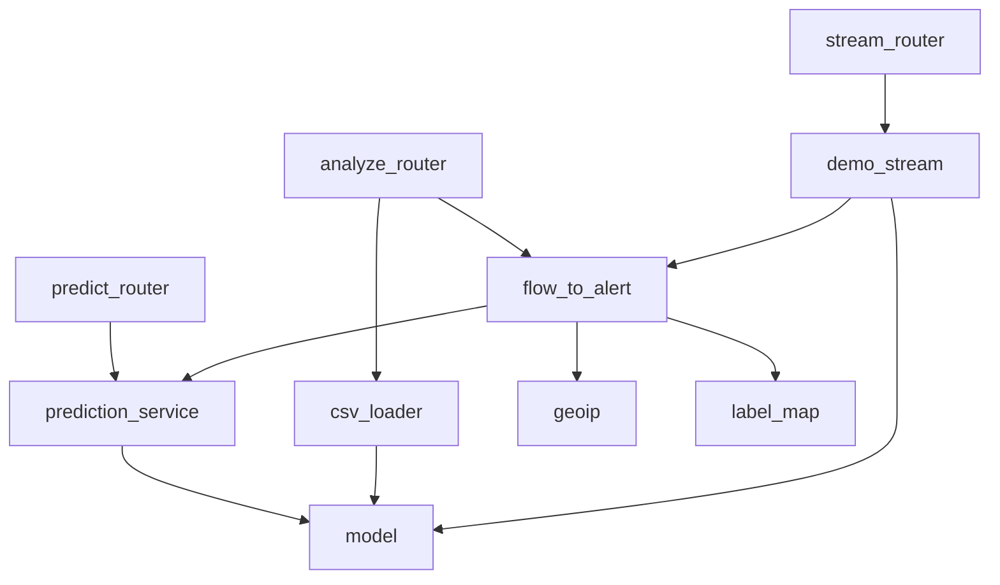

# 06 · Services & Function Analysis

> Function-level depth: purpose, params, return, step-by-step flow, complexity, edge cases, possible
> bugs, improvements. This is the chapter to skim before a "explain this function" live-coding round.

Notation: **T** = time complexity, **S** = space complexity, **n** = rows, **F** = 78 features.

---

## Service map (who calls whom)

---

## `model.py` — the ML primitives

### `vectorize(features) -> np.ndarray[F]`
- **Purpose:** turn a dict *or* list input into a fixed-order float32 vector of length 78.
- **Flow:** list → length-check → array; dict → check all `FEATURE_NAMES` present → pull in order.
- **T:** O(F). **S:** O(F).
- **Edge cases:** wrong list length → `HTTPException(400)`; missing dict keys → `400` listing first 5.
- **Why it matters:** this is the **feature-order gate**. Dict order is irrelevant because it reorders to `FEATURE_NAMES`. A list is trusted to already be in order (length-checked only) — *a list in the wrong order is silently wrong.* Worth flagging as a footgun.
- **Improvement:** accept and validate value ranges; warn if a list looks pre-scaled.

### `load_models()` -> None
- **Purpose:** lazily load the heavy Keras model + SHAP explainer once; warm up the graph.
- **Flow:** idempotent guard → import `shap`,`tensorflow` → `load_model(compile=False)` → `GradientExplainer(model, background)` → one warm-up `predict`.
- **T:** seconds (one-time). **S:** ~hundreds of MB–GB.
- **Why `compile=False`:** inference doesn't need the optimizer/loss; skipping compilation loads faster and avoids version-mismatch warnings.
- **Why warm up:** the first `predict` triggers TF graph tracing/XLA; doing it at startup keeps the first *user* request fast.
- **Possible bug / race:** if two threads call `load_models()` before startup completes, both could load (the guard checks then sets without a lock). In practice `lifespan` calls it once, single-threaded, pre-traffic — so it's safe. A `threading.Lock` would make it bullet-proof.

### `get_model()` / `get_explainer()`
- Thin lazy accessors → call `load_models()` if needed, return the global. These are the **seams** you'd wrap in FastAPI `Depends` for mockability.

### Module-load side effects (read this carefully)
At **import** time `model.py`:
1. `joblib.load(scaler)` — gets the scaler + `feature_names_in_`.
2. loads `class_labels.json` → `LABELS`, `N_FEATURES`.
3. derives `FEATURE_NAMES`; asserts `len == N_FEATURES` (raises `RuntimeError` otherwise — fail fast).
4. picks & loads the SHAP `background` (real → demo → synthetic).

So importing `model.py` is **cheap and TF-free** but not side-effect-free. Good: `health.py`/tests get
metadata without TensorFlow. The trade is that import does disk I/O — acceptable, runs once.

---

## `prediction_service.py` — orchestration

### `_to_model_input(raw, already_scaled) -> (1,F,1)`
- Scales (unless already scaled) and reshapes to the Conv1D input. **T:** O(F).
- **Why the flag:** demo flows from `demo_flows.npy` are pre-scaled; scaling them again would distort inputs. This flag prevents double-scaling. **Footgun:** pass `already_scaled=True` on *raw* data and you feed unscaled values to a model trained on [0,1] → garbage. The callers get it right; a stricter design would sanity-check the value range.

### `infer_fast(raw, already_scaled) -> (label, idx, conf, probs)`
- 1 forward pass + argmax. **T:** O(model). **S:** O(11).

### `infer_explained(...) -> (label, idx, conf, probs, contributions[F])`
- Forward pass + SHAP. Handles list-vs-ndarray SHAP output; trims to F if needed. **T:** O(SHAP) ≫ forward. 
- **Edge case:** `if contributions.shape[0] != N_FEATURES: contributions = contributions[:N_FEATURES]` — defensive trim against shape surprises.

### `predict_fast / predict_explained / predict_batch`
- Thin adapters from `PredictRequest` → response models.
- `predict_explained` builds 78 `ShapContribution`, sorts by `|value|`, slices `max(1, top_k)` (guards `top_k=0`).
- `predict_batch` = list comprehension of `predict_fast` per flow. **T:** O(n · forward). **Bug/limitation:** not vectorized — n separate `model.predict` calls. Batching into one `(n,78,1)` tensor would be much faster (see [11](11-Improvements.md)).

---

## `csv_loader.py` — input validation

### `load_csv(csv: UploadFile) -> list[dict]`
- **Steps:** `pd.read_csv` (parse-fail→400) → empty→400 → strip column names → check all 78 present (missing→400) → **reorder to `FEATURE_NAMES`** → `to_numeric(coerce)` → `±inf/NaN → 0.0` → row-cap (>5000→400) → `to_dict('records')`.
- **T:** O(n·F). **S:** O(n·F) (whole CSV in memory via pandas).
- **WHY each guard:** real flow CSVs have stray header spaces, divide-by-zero `inf`, and can be huge. Each line of this function maps to a real-world failure.
- **Edge case — `inf/NaN→0`:** zeroing is a *pragmatic* choice (the test `test_inf_and_nan_become_zero` pins it). After MinMax scaling 0 maps to the feature's min — usually benign. A stricter alternative: drop the row, or impute the column median.
- **Limitation:** `pd.read_csv(csv.file)` buffers the entire upload before the row-cap check, so a giant file still loads into RAM first. nginx's `client_max_body_size 64m` is the real byte-level guard. A streaming/`nrows`-limited read would harden this.

### `synth_meta(row) -> FlowMeta`
- Fabricates `src_ip` (random public), `dst_ip` (`10.0.0.x`), `protocol` (random TCP/UDP/ICMP) and pulls `Flow Duration`/`Total Fwd Packets` from the row for display.
- **Why:** the CICIDS feature CSV has no IPs/protocol (dropped in preprocessing). These are **display-only** and explicitly synthetic.

---

## `flow_to_alert.py` — the mapper

### `flow_to_alert(features, meta, include_shap, already_scaled) -> Alert`
- **Purpose:** single place that turns a model prediction into the frontend's `Alert` domain object.
- **Flow:** `infer_explained` or `infer_fast` → severity via `to_severity` → **geo only if not BENIGN** (and only if a GeoIP DB is mounted) → assemble `Alert` with `uuid4` id and `timestamp` (meta's or `utcnow`).
- **T:** O(forward) or O(SHAP). 
- **Design note:** geo lookup is skipped for BENIGN (no point mapping normal traffic) and short-circuits when geoip is disabled — cheap by default.
- **Edge case:** `features.flatten()[i]` for `raw_input` works whether features come in as `(78,)` or `(78,1)`.

---

## `demo_stream.py` — the live-stream data source

### Reservoir sampling (`sample_from_file(path, k)`)
- **Algorithm:** classic **Reservoir Sampling (Algorithm R)** — one pass, keeps a uniform random k-sample without knowing the file length, O(1) memory beyond the reservoir.
- **Why:** the raw CICIDS CSVs are huge; you can't load them all to sample. Reservoir sampling gets a uniform 200-row sample in a single streaming pass. Seeded (`random.Random(42)`) for reproducibility.
- **T:** O(rows in file). **S:** O(k).
- **Interview gold:** being able to explain reservoir sampling from this code is a classic algorithms question — know the `j = rng.randint(0, i); if j < k: reservoir[j] = item` trick and *why it yields uniform probability k/i*.

### `parse_row` / index discovery (`_find_index`)
- `parse_row` rejects rows that are short, non-float, or non-finite → guarantees clean vectors.
- `_find_index` finds the column index for "flow duration"/"fwd packets" by exact-then-substring match — robust to header naming differences.

### Fallback chain (import-time)
`raw CSVs present` → use sampled flows (need scaling). Else `demo_flows.npy` (already scaled, `FLOWS_ALREADY_SCALED=True`). Else the SHAP `background` (already scaled). This is why the demo works on a clean Docker image with no raw data.

### `next_demo_alert()`
- `random.choice(all_flows)` → `FlowMeta` with synthetic IPs + real duration/packets → `flow_to_alert(..., already_scaled=FLOWS_ALREADY_SCALED)`. **T:** O(forward).

---

## `geoip.py` — optional enrichment

### `lookup(ip) -> dict | None` (`@lru_cache(maxsize=10000)`)
- **Disabled by default:** `_reader is None` unless `NIDS_GEOIP_DB_PATH` points at a real `.mmdb`.
- **Flow:** private IP → None; invalid → None; MaxMind `city(ip)`; no coords → None; else `{lat,lng,city}`.
- **Why LRU cache:** the same source IPs recur in a stream; memoizing avoids repeated DB lookups. 10k entries bound memory.
- **Edge case:** `ipaddress.ip_address(ip).is_private` filters RFC1918 (the synthetic `10.0.0.x`) so private IPs never hit the DB.
- **Failure handling:** every external call is wrapped — any exception → `None`, never crashes a request. Geo is strictly best-effort.

---

## `label_map.py` — pure policy

### `to_severity(label) -> Severity`
- Dict lookup with `.get(label, "low")`. **T:** O(1). Pure, trivially testable (`test_label_map.py`).
- **Why a default:** if the model ever emits a label not in the map (future class), severity degrades gracefully to `low` instead of throwing.

---

## Schemas (`schemas.py`) — the contract objects

| Model | Notable fields | Note |
|---|---|---|
| `PredictRequest` | `features: dict|list`, `top_k` | dual input shape |
| `PredictResponseFast` | class, index, confidence | fast path |
| `PredictResponse` | + `probabilities{11}`, `top_contributions`, `all_contributions` | explain path |
| `ShapContribution` | feature, value, raw_input | one attribution |
| `Alert` | camelCase `srcIP/dstIP/flowDuration/fwdPackets`, `severity` (Literal), `geo?`, `shapValues?` | the frontend's view object |
| `FlowMeta` | src/dst ip, protocol, durations | display metadata |
| `AnalyzeResponse` | `alerts[]`, `summary` | batch result |
| `AnalyzeSummary` | total, benign, malicious, by_class | dashboard rollup |

**Why camelCase in `Alert` but snake elsewhere?** `Alert` is shaped to match the **TypeScript frontend**
directly (`srcIP`, `flowDuration`), minimizing client-side remapping. The `api.ts` `normalizeAlert`
still adds Date parsing + geo fallback, but field names line up. The `Severity` `Literal` type makes
invalid severities a validation error.

---

## Complexity summary table

| Function | Time | Space | Hot path? |
|---|---|---|---|
| `vectorize` | O(F) | O(F) | yes |
| `infer_fast` | O(forward) | O(1) | yes (`/predict`, stream, batch) |
| `infer_explained` | O(SHAP) ≫ forward | O(F) | `/explain`, capped batch |
| `load_csv` | O(n·F) | O(n·F) | `/analyze`, `/batch` |
| `predict_batch` | O(n·forward) | O(n) | `/batch` — **not vectorized** |
| `sample_from_file` | O(file rows) | O(k) | startup only |
| `to_severity` | O(1) | O(1) | yes |
| `geoip.lookup` | O(1) amortized (cached) | O(cache) | `/analyze` non-BENIGN |

---

## Top "possible bugs / sharp edges" to mention proactively

1. **List inputs aren't order-validated** — only length-checked; a mis-ordered list silently mispredicts.
2. **`predict_batch` isn't vectorized** — n forward passes; slow for big CSVs.
3. **`already_scaled` footgun** — wrong flag = wrong scaling, silent garbage.
4. **CSV fully buffered before row-cap** — large file loads to RAM first; nginx byte-cap is the real guard.
5. **`inf/NaN → 0`** — pragmatic but lossy; could mask anomalies.
6. **`datetime.utcnow()`** — naive UTC (deprecated-ish in 3.12); `datetime.now(timezone.utc)` is the modern form.
7. **`load_models()` lacks a lock** — safe in practice (lifespan), not in theory.
