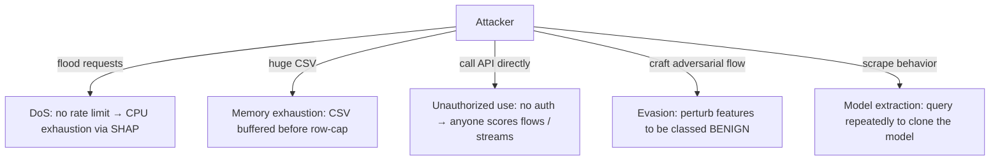

# 07 · Security

> Be honest and structured. This is a **demo/research API with no auth**. The strong-candidate move
> is to (a) state the current posture plainly, (b) give a real threat model, (c) show exactly what
> you'd add for production and in what order. Pretending it's secure is the failure mode.

---

## 1. Current security posture (the truth)

| Control | Status | Where |
|---|---|---|
| Authentication | ❌ none | every route is public |
| Authorization / RBAC | ❌ none | no roles, no per-resource checks |
| JWT / OAuth / sessions | ❌ none | no identity at all |
| API keys | ❌ none | no client identification |
| Rate limiting | ❌ none (app level) | nginx could, but isn't configured to |
| CORS | ✅ allow-list | `settings.CORS_ORIGINS` |
| Input validation | ✅ strong | Pydantic + `vectorize` + `load_csv` |
| Upload size limits | ✅ | `MAX_UPLOAD_ROWS=5000`, nginx `client_max_body_size 64m` |
| Error-detail leakage | ✅ prevented | global handler returns generic 500 |
| Secrets management | ✅ minimal/none needed | only `NIDS_*` config; no DB creds/API keys |
| Non-root container | ✅ | Docker runs as `uid 1000` |
| TLS/HTTPS | ✅ at the edge | HF Spaces / Vercel terminate HTTPS+WSS |

---

## 2. What the template asks about — mapped honestly

### JWT / OAuth / Sessions
**Not present.** This is the single biggest production gap. If you add auth, **API keys** are the
right first step for a machine-facing inference API (simpler than full OAuth):
- issue keys, store **hashes** (never plaintext), check via a FastAPI dependency `Depends(require_key)`.
- For the human dashboard, layer OAuth/OIDC (Google) or session cookies.

### RBAC
Two natural roles: **analyst** (read alerts, run analysis) and **admin** (rotate keys, swap model).
Implement as a claim/role on the API key or JWT, enforced by a dependency.

### SQL Injection
**Not applicable — there is no database and no SQL.** Inputs never reach a query engine. (If you add
the Postgres schema from [04](04-Data-and-Model-Store.md), use parameterized queries / an ORM — never string-format SQL.)

### NoSQL Injection
**Not applicable** — no Mongo/document store.

### Prompt Injection
**Not applicable** — there is **no LLM and no prompts**. Inputs are numeric feature vectors fed to a
CNN; there's no instruction-following surface to hijack. (Good thing to state crisply — it shows you
know prompt injection is an LLM-specific class of attack.)

### XSS
Backend returns JSON, not HTML, so it isn't an XSS source itself. XSS risk lives in the **frontend**:
React escapes by default, and alert fields (IP, class) are model/synthetic, not free user text. The
one place to watch: rendering `geo.city` or any string field — React's default escaping covers it as
long as you don't use `dangerouslySetInnerHTML`.

### CSRF
Low risk today: the API is stateless and token-less, so there's no ambient session cookie for a forged
request to ride on. **If** you add cookie-based sessions, you then need CSRF tokens / `SameSite`
cookies. With bearer API keys (no cookies), CSRF is moot.

### Input sanitization
**This is the project's actual security strength.** Three gates:
1. **Pydantic** rejects wrong types/shapes → 422.
2. **`vectorize`** enforces feature count/names → 400.
3. **`load_csv`** enforces columns, coerces numerics, neutralizes `inf/NaN`, caps rows → 400.
This prevents malformed input from reaching TensorFlow (which could otherwise crash or misbehave on
NaN/inf) and bounds memory/CPU per request.

---

## 3. Threat model (STRIDE-lite)



| Threat | Severity | Today's mitigation | What I'd add |
|---|---|---|---|
| **DoS via expensive SHAP** | high | `ANALYZE_SHAP_CAP=50`, single-process | rate limiting, per-key quotas, queue + worker pool, timeouts |
| **Memory exhaustion (CSV)** | med | `MAX_UPLOAD_ROWS`, nginx 64m | stream-parse with `nrows`, reject early by Content-Length |
| **Unauthorized use** | med | CORS (browser-only), private-by-default Space | API keys + auth dependency |
| **Adversarial evasion** | med (research) | none | adversarial training, ensemble, anomaly score, confidence floor |
| **Model extraction** | low | none | rate limit + monitoring of query patterns |
| **Info leak on errors** | low | generic 500 handler | structured error logging w/o PII |

> **Important note on adversarial ML:** a *security* model is itself an attack target. An adversary who
> can shape their traffic features may craft flows the CNN labels BENIGN (evasion). The honest answer
> in an interview: "ML NIDS shifts the arms race from signatures to feature-space evasion; defenses
> include adversarial training, ensembling, and not relying on the classifier alone."

---

## 4. CORS — the one access control that exists

```python
CORSMiddleware(allow_origins=settings.CORS_ORIGINS, allow_methods=["*"], allow_headers=["*"])
```
- **Purpose:** only listed browser origins may call the API from JS. In prod you set `NIDS_CORS_ORIGINS` to your Vercel URL.
- **What it does NOT do:** CORS is **browser-enforced only**. It is *not* authentication — `curl`/scripts ignore it entirely. Say this explicitly; conflating CORS with auth is a classic junior mistake.
- `allow_methods/headers=["*"]` is permissive but fine given no credentials/cookies are used.

---

## 5. Secrets & config

- The app needs **no secrets** today (no DB password, no third-party API key). All config is non-secret `NIDS_*` env vars with defaults → nothing sensitive to leak.
- `.env.example` documents every variable; real `.env` is gitignored.
- The optional GeoIP DB path is a filesystem mount, not a secret.
- **If** you add API keys/DB: use the platform secret store (HF Spaces "Variables and secrets", Vercel env), never commit them, and store key **hashes** not plaintext.

---

## 6. Container & transport security (what IS done well)

- **Non-root:** Dockerfile creates `user` (uid 1000) and runs as them; caches redirected to `/tmp`. Limits blast radius if the process is compromised.
- **Minimal image:** multi-stage build → slim runtime, fewer packages = smaller attack surface.
- **World-readable venv, not chowned:** deliberate (avoids a costly recursive chown) while staying non-root.
- **TLS:** HTTPS/WSS terminated by the hosting platform (HF Spaces, Vercel) — you don't manage certs.
- **Healthcheck:** lets the orchestrator restart a wedged container.

---

## 7. Production hardening checklist (priority order)

1. **Auth:** API keys (hashed) via a FastAPI dependency; OAuth for the dashboard.
2. **Rate limiting:** per-IP/key (slowapi, nginx `limit_req`, or an API gateway) — protects the SHAP path.
3. **Request timeouts** on inference + a worker pool so one slow SHAP call can't stall the loop.
4. **Stream-parse uploads** (`nrows`, Content-Length pre-check) to close the memory vector.
5. **Confidence floor / OOD detection** so the model doesn't emit overconfident nonsense on weird traffic.
6. **Audit logging** (who scored what, when) — needs the DB from [04](04-Data-and-Model-Store.md).
7. **Security headers** at nginx (HSTS, CSP, X-Content-Type-Options).
8. **Dependency scanning** (TensorFlow/SHAP CVEs) in CI.

---

## Interview questions

1. *Is your API secure?* → "For a demo, the input-validation and container hardening are solid, but there's **no authn/authz or rate limiting** — those are my top three production additions, in that order." (Confidence + honesty wins.)
2. *Does CORS protect your API?* → No — it's browser-enforced only; `curl` bypasses it. It's not authentication.
3. *SQL injection risk?* → None — no database/SQL. If I add one, parameterized queries/ORM.
4. *Prompt injection?* → N/A — no LLM/prompts; inputs are numeric vectors.
5. *Biggest DoS risk?* → the unbounded, unauthenticated **SHAP** path; mitigate with rate limits, quotas, timeouts, a worker pool.
6. *How would you add auth with minimal disruption?* → an API-key `Depends` on the routers; the service layer is untouched because auth is a transport concern.
7. *Adversarial attacks on the model itself?* → feature-space evasion; defenses are adversarial training, ensembling, anomaly scoring, and defense-in-depth.
