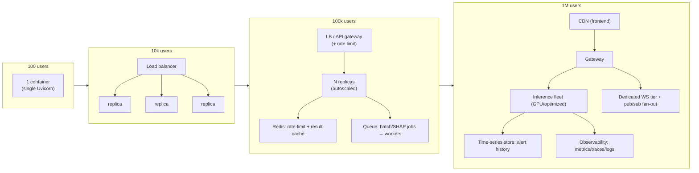

# 08 · Performance & Scalability

> Where the latency goes, what's cached, and the 100 → 1,000,000 user story. This is your
> system-design-round chapter.

---

## 1. Where time actually goes

| Operation | Relative cost | Notes |
|---|---|---|
| **Model load (startup)** | seconds, once | paid in `lifespan`, not per request |
| `/predict` (fast) | ~milliseconds | one TF forward pass on `(1,78,1)` after warm-up |
| `/predict/explain` (SHAP) | **10×–100× the forward pass** | gradient passes over the background — the real cost |
| `/api/analyze` (n rows) | O(n) forward + ≤50 SHAP | SHAP-capped to bound tail latency |
| `/predict/batch` (n rows) | O(n) **separate** forward passes | not vectorized → the obvious win |
| CSV parse (`load_csv`) | O(n·F), pandas in RAM | bounded by 5000-row cap |
| WS tick | one forward pass / second | trivial at 1 Hz |

> **The headline performance fact:** SHAP dominates everything. Every performance decision in the
> codebase is really "how do we avoid paying for SHAP when we don't need it" — hence the fast/explain
> split and the `ANALYZE_SHAP_CAP`.

---

## 2. Optimizations already in the code

| Technique | Where | Win |
|---|---|---|
| **Model singleton + warm-up** | `model.py`, `lifespan` | model loaded once; first request not penalized |
| **`compile=False` load** | `load_models()` | faster load, no optimizer state |
| **Lazy TF import** | `load_models()` | metadata/tests don't import TensorFlow |
| **Two-tier API (fast vs explain)** | `predict.py` | clients pay for SHAP only when they want it |
| **SHAP cap in batch** | `analyze.py` | bounds worst-case latency on big uploads |
| **Row cap + nginx body cap** | `csv_loader.py`, `nginx.conf` | bounds memory/CPU per request |
| **LRU cache on geoip** | `geoip.py` | repeated source IPs don't re-hit the DB |
| **Reservoir sampling** | `demo_stream.py` | sample huge CSVs in O(1) extra memory |
| **Async WebSocket** | `stream.py` | non-blocking push; many idle clients cheap |
| **Static asset caching** | `nginx.conf` | fingerprinted `/assets/` cached 1 year immutable |

---

## 3. Concurrency & thread-safety

- **ASGI/async:** FastAPI on Uvicorn. The WS handler is `async` and yields on `asyncio.sleep`, so one event loop serves many idle sockets cheaply.
- **Sync route functions:** `/predict` etc. are `def` (not `async def`). FastAPI runs sync routes in a **threadpool**, so a blocking `model.predict` doesn't stall the event loop. Good default.
- **Model thread-safety:** `model.predict` is safe to call concurrently (read-only weights). The singleton is read-only after load.
- **The one sharp edge:** the WS loop calls a **blocking** `model.predict` *inside* the async coroutine (not via the threadpool). At 1 Hz with a few clients it's invisible; at high fan-out it would block the event loop. Fix: `await run_in_threadpool(next_demo_alert)` or precompute a rolling buffer of alerts.

---

## 4. The template's perf checklist — mapped

| Concept | In this project? | Comment |
|---|---|---|
| Caching | partial | geoip LRU + nginx static cache; no response/result cache |
| **Redis** | ❌ | not needed yet; would back rate-limits, a result cache, or pub/sub fan-out |
| Indexes | n/a | no DB (geoip mmdb has internal index) |
| Connection pooling | n/a | no DB connections |
| Async processing / queues | ❌ | inference is synchronous; a queue would decouple slow SHAP/batch |
| Pagination | ❌ | batch returns all rows (bounded by 5000 cap) |
| Streaming | ✅ | WebSocket alert stream |
| Concurrency | ✅ | async loop + sync-route threadpool |
| Batching | ⚠️ partial | endpoint exists but loops per-row (not tensor-batched) |
| Compression | ⚠️ | not enabled; add `GZipMiddleware` / nginx gzip for large JSON |

---

## 5. The scaling story: 100 → 1,000,000 users

The key property: **the inference service is stateless** → it scales horizontally by cloning. The
scaling pain only appears once you add stateful pieces (history DB, rate-limit store, fan-out).

### 100 users — single box
- One container (`docker compose up`) handles it. Bottleneck: none worth fixing.
- **Action:** ship it. Add `/health`-based restart (already in Docker).

### 10,000 users — replicate behind a load balancer
- **Problem:** one process saturates CPU under concurrent SHAP/batch.
- **Fix:** run **N identical stateless replicas** behind an LB (round-robin). Because there's no shared state, this "just works." WebSockets need **sticky sessions** or a connection-aware LB.
- **Quick win first:** **vectorize batch inference** (one tensor, not n calls) — biggest single throughput gain with zero infra.

### 100,000 users — decouple the slow path
- **Problems:** SHAP/batch latency spikes; no backpressure; thundering WS reconnects.
- **Fixes:**
  - **Queue + worker pool** (Celery/RQ/arq + Redis) for `/api/analyze` and SHAP → return a job id, poll/stream results. Protects the request tier.
  - **Redis** for rate limiting (per key) and a **result cache** (identical flow → cached label; flows repeat in scans).
  - **Autoscaling** on CPU/queue depth.
  - **Separate the WS tier** so streaming load doesn't compete with REST.

### 1,000,000 users — specialize every tier
- **Frontend** on a CDN (already static via Vercel).
- **Inference fleet:** GPU or optimized runtime (ONNX Runtime / TF-Serving / Triton), model **quantized** (TFLite/int8 already prototyped). Batch requests server-side (dynamic batching) for throughput.
- **WS fan-out:** a pub/sub bus (Redis/NATS/Kafka) so any WS node can deliver any alert; horizontal WS nodes.
- **Alert history:** a time-series/columnar store (Timescale/Clickhouse), partitioned by time, rollup tables for dashboards.
- **Observability:** metrics (Prometheus), tracing (OpenTelemetry), structured logs, **circuit breakers** around the model/queue, SLOs on p99 latency.

### Scaling summary table

| Users | Compute | State | New infra | First thing to fix |
|---|---|---|---|---|
| 100 | 1 container | none | none | nothing |
| 10k | N replicas + LB | none | load balancer, sticky WS | **batch vectorization** |
| 100k | autoscaled fleet | Redis | queue+workers, cache, rate limit | decouple SHAP/batch |
| 1M | GPU/optimized fleet, CDN | Redis + TSDB + bus | pub/sub, TSDB, observability | dynamic batching + WS fan-out |

---

## 6. Observability (what exists vs what you'd add)

- **Today:** the request-timing middleware logs `method path -> status (ms)`; model load logs timing; Docker healthcheck. That's the floor.
- **Add for scale:** Prometheus metrics (request rate, p50/p99 latency, per-class prediction counts, SHAP duration histogram), OpenTelemetry traces (router→service→model spans), structured JSON logs with request ids, alerting on error rate / latency SLOs, and a model-drift monitor (prediction distribution over time).

---

## 7. Quick-win optimization backlog (ranked)

1. **Vectorize `predict_batch`** — one `(n,78,1)` tensor instead of n calls. Huge, free.
2. **Threadpool the WS `model.predict`** — unblock the event loop under fan-out.
3. **Response gzip** — large `/api/analyze` JSON compresses well.
4. **Result cache** (Redis or even in-proc LRU) for repeated identical flows.
5. **Confidence-aware short-circuit** — skip SHAP if confidence is trivially high/low per policy.
6. **ONNX/TF-Serving** for lower per-inference latency at scale.

---

## Interview questions

1. *Where's your latency?* → SHAP dominates; the fast/explain split and SHAP cap exist precisely to manage it.
2. *How do you scale to 1M users?* → stateless inference → clone behind an LB; then queue+Redis to decouple SHAP/batch; then GPU/ONNX + dynamic batching + pub/sub WS fan-out + TSDB for history.
3. *What breaks first under load?* → the unbatched batch endpoint and the unbounded SHAP path; fix batching and add a queue.
4. *Sync or async routes — why?* → async WS for cheap idle sockets; sync `def` routes run in FastAPI's threadpool so blocking `predict` doesn't stall the loop.
5. *Why is statelessness the key scaling property?* → no shared mutable state means replicas are interchangeable; you scale by adding containers, not by sharding state.
6. *What would you cache?* → static assets (done), geoip (done), and identical-flow results (to add); plus model is "cached" in memory as a singleton.
