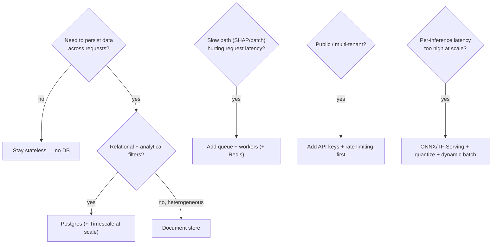

# 09 · Design Decisions (Why X, Why not Y)

> For every major choice: why this, why not the alternative, advantages/disadvantages, and the
> one-line interview answer. This is the chapter that wins "why did you…" questions.

Format for each: **Decision · Why · Alternatives · Tradeoff · Interview one-liner.**

---

## Why FastAPI (not Flask/Django/Express)?
- **Why:** async-native (needed for WebSocket streaming), automatic Pydantic validation, auto OpenAPI docs (`/docs`), type-hint-driven, minimal boilerplate, great for ML inference services.
- **Alternatives:** Flask (sync, no built-in validation/async, needs extensions), Django (heavy, ORM-centric — pointless with no DB), Express/Node (would split the stack across languages; the ML lives in Python).
- **Tradeoff:** smaller ecosystem than Flask/Django; younger. Worth it.
- **One-liner:** *"FastAPI gives me async WebSockets, free validation, and OpenAPI docs in idiomatic Python — the natural home for a TensorFlow inference service."*

## Why a 1D-CNN (not XGBoost / MLP / Transformer)?
- **Why:** flows are ordered numeric vectors; 1D convolutions learn local feature interactions cheaply; matches the CICIDS deep-learning literature; hits 99.48%.
- **Alternatives:** **XGBoost** (often equal/better on tabular, faster to train, easy SHAP) — the strongest alternative; **MLP** (no locality prior); **TabTransformer/FT-Transformer** (heavier, more data-hungry).
- **Tradeoff:** a CNN is arguably overkill for tabular data; the honest answer is "I'd A/B it against XGBoost." Don't oversell the CNN.
- **One-liner:** *"1D-CNN to exploit local feature structure and follow the literature, but I'd benchmark XGBoost — on tabular it's frequently just as strong and cheaper."*

## Why SHAP for explainability (not LIME / attention / none)?
- **Why:** SOC analysts must trust/justify alerts; SHAP gives theoretically-grounded, signed per-feature attributions; `GradientExplainer` is cheap for neural nets.
- **Alternatives:** LIME (local, less consistent), Integrated Gradients (similar, also gradient-based), KernelSHAP (model-agnostic but slow), no explanation (black box — unacceptable for security).
- **Tradeoff:** SHAP is the latency bottleneck → isolated to `/explain` and capped in batch.
- **One-liner:** *"Explainability is a product requirement for a SOC; SHAP gives principled attributions and GradientExplainer keeps it tractable for a neural net."*

## Why no database?
- **Why:** stateless inference service — output is a pure function of input + read-only model; nothing to persist.
- **Alternatives:** Postgres/Mongo — would be infra with no current purpose (accidental complexity).
- **Tradeoff:** no alert history/audit/feedback until a requirement appears; I designed the schema for when it does (see [04](04-Data-and-Model-Store.md)).
- **One-liner:** *"It's a pure inference function; a DB without a persistence requirement is complexity I'd be adding for show. I know exactly when and how I'd add one."*

## Why REST + WebSocket (not gRPC / GraphQL / SSE)?
- **Why:** REST for request/response prediction (simple, cacheable, browser-native, OpenAPI); WebSocket for server-push live alerts (bidirectional, low overhead, broad support).
- **Alternatives:** **gRPC** (great for service-to-service, but awkward from browsers, needs proxy); **GraphQL** (overkill — few, fixed shapes); **SSE** (one-way, simpler than WS — a legit alternative for the alert stream since it's push-only). 
- **Tradeoff:** WS needs proxy `Upgrade` handling (configured in nginx) and reconnect logic (in `api.ts`). SSE would've been slightly simpler but WS is fine.
- **One-liner:** *"REST for predictions, WebSocket for the push stream; SSE would also work for the one-way feed, but WS keeps the door open for client→server messages."*

## Why TensorFlow/Keras (not PyTorch)?
- **Why:** mature Keras `Sequential` API for a simple CNN, easy `.h5` save/load, first-class **TFLite** export for edge, `tensorflow-cpu` is light to deploy.
- **Alternatives:** PyTorch (more popular in research; would need ONNX/TorchScript for the edge story).
- **Tradeoff:** TF deployment is heavier/clunkier than some; offset by TFLite + the CPU build.
- **One-liner:** *"Keras for a clean model definition and a straight path to TFLite for edge sensors."*

## Why MinMaxScaler (not StandardScaler/RobustScaler)?
- **Why:** bounds inputs to [0,1] which suits NN training; combined with 99th-percentile clipping it tames heavy-tailed flow stats; same fitted scaler reused at serve time.
- **Alternatives:** StandardScaler (zero-mean/unit-var — fine but unbounded), RobustScaler (median/IQR — good for outliers, but we already clip).
- **Tradeoff:** MinMax is sensitive to outliers → that's exactly why clipping precedes it.
- **One-liner:** *"Clip-then-MinMax gives bounded, comparable features for the CNN, and I persist the fitted scaler to kill train/serve skew."*

## Why undersampling (not class weights / SMOTE)?
- **Why:** majority classes still have 50k samples after capping — plenty; simpler and faster than weighting/oversampling.
- **Alternatives:** class weights (no data lost, weights the loss), SMOTE (synthesizes minority samples — risky on network data).
- **Tradeoff:** throws away majority data; Botnet recall (77.75%) suggests class weighting/focal loss could help the smallest classes.
- **One-liner:** *"Undersampling to 50k/class was the pragmatic lever; the weak Botnet recall tells me class weights or focal loss are the next experiment."*

## Why Docker + multi-stage build?
- **Why:** reproducible env (TF version pinning matters), build deps isolated from runtime → small image, non-root runtime user, one-command full stack via compose.
- **Alternatives:** bare venv deploy (fragile across hosts), single-stage Docker (bloated image with build tools).
- **Tradeoff:** image build is slow (~10–15 min, TF is large).
- **One-liner:** *"Multi-stage Docker keeps the runtime slim and non-root while pinning the exact TF stack the model needs."*

## Why Hugging Face Spaces (backend) + Vercel (frontend)?
- **Why:** HF free tier gives **16 GB RAM** (most free hosts can't fit TensorFlow) and supports Docker + WebSockets; Vercel auto-builds Vite with instant HTTPS.
- **Alternatives:** Render/Railway/Fly (RAM-limited free tiers struggle with TF), a single VPS (more ops).
- **Tradeoff:** free Spaces cold-start (~30 s) after idle; demo-acceptable.
- **One-liner:** *"HF Spaces is the rare free host with enough RAM for TensorFlow + WebSockets; Vercel makes the static frontend trivial."*

## Why nginx in front of the frontend?
- **Why:** serves the static SPA, reverse-proxies `/api /ws /health /predict` to the backend on the internal network (→ **same-origin**, so CORS/preflight largely vanish), handles WS `Upgrade`, caches assets, sets upload size/timeout.
- **Alternatives:** serve static from FastAPI (couples concerns), call the API cross-origin from the browser (more CORS, exposes backend host).
- **Tradeoff:** one more component; well worth it for same-origin + WS proxying.
- **One-liner:** *"nginx makes the whole app same-origin and handles WebSocket upgrades and static caching the FastAPI app shouldn't."*

## Why config via env vars (12-factor) and a Settings object?
- **Why:** same image runs in dev/prod by changing env; no secrets in code; one typed source of truth.
- **Alternatives:** hardcoded constants (not portable), a config file (one more artifact to mount).
- **One-liner:** *"12-factor config: one image, behavior set by `NIDS_*` env, sane defaults so a clean clone just runs."*

## Why the fast/explain split (two endpoints, not one flag)?
- **Why:** clearer contracts (`PredictResponseFast` vs `PredictResponse`), self-documenting in `/docs`, the fast path can never accidentally pay SHAP cost.
- **Alternatives:** `/predict?explain=true` (one endpoint, dynamic response shape — also valid).
- **One-liner:** *"Two endpoints make the cost and the response shape explicit; SHAP is opt-in by URL, not a footgun flag."*

## Why graceful artifact fallbacks (background, demo flows)?
- **Why:** the 149 MB processed dataset isn't committed; the app must deploy from a clean clone and run on HF's read-only-HOME non-root container.
- **Alternatives:** require the big files (breaks clean-clone deploy), crash if absent (fragile).
- **One-liner:** *"Ordered fallbacks (real → committed sample → synthetic) mean a fresh clone deploys and demos without the 149 MB dataset."*

---

## Decision tree: "should I add X to this project?"

---

## The meta-answer (memorize)
> *"Every decision here optimizes for the same two things: **a correct, explainable ML contract** and
> **deploy-anywhere simplicity**. I added complexity only where it earned its place — singletons for
> the expensive model, a two-tier API for the expensive explanation, graceful fallbacks for clean-clone
> deploys — and I deliberately left out a DB, auth, and queues because nothing in the current
> requirements needs them yet. I can tell you exactly when each would go in."*
