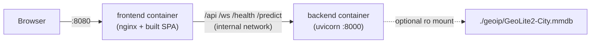
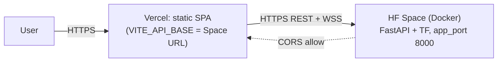
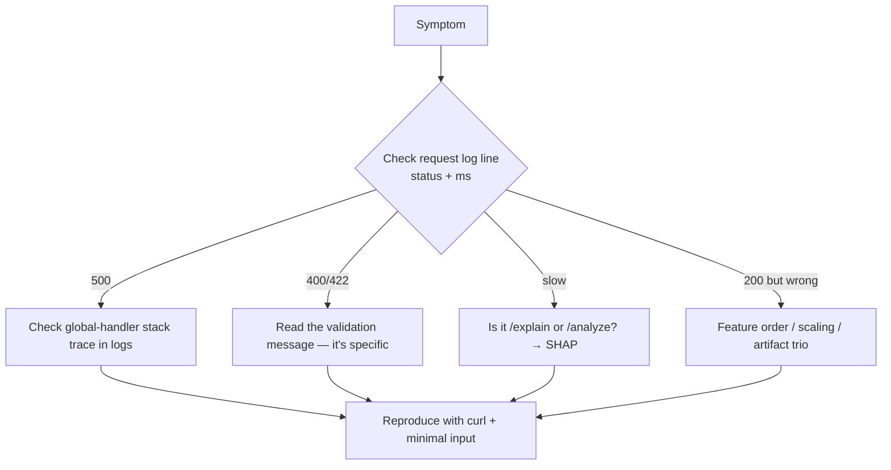

# 10 · Deployment & Debugging

> How it ships, what every env var does, and a concrete playbook for the bugs you'll actually hit.

---

## 1. The two deployment modes

### A) Local full stack — `docker compose up --build`

- Frontend published on **:8080**; backend has **no host port** (reached only via nginx on the compose network).
- `depends_on: backend healthy` → frontend waits for the backend's `/health` to pass before starting.
- Same-origin: the browser only ever talks to nginx, which proxies to the backend → minimal CORS.

### B) Free hosted demo — HF Spaces (backend) + Vercel (frontend)

- Backend honors `$PORT` (HF doesn't inject it → stays 8000); deploys from a clean clone (no 149 MB dataset needed).
- `deploy/prepare_hf_space.sh` copies exactly the serving files + sets up Git LFS for the 34 MB model.
- Wire-up: set `VITE_API_BASE` (Vercel) → Space URL; set `NIDS_CORS_ORIGINS` (HF) → Vercel URL.

---

## 2. The Dockerfile, explained

```dockerfile
# Stage 1 (builder): create a venv, pip install requirements.txt
FROM python:3.11-slim AS builder → python -m venv /opt/venv → pip install -r requirements.txt
# Stage 2 (final): slim runtime, copy the venv, run as non-root
FROM python:3.11-slim AS final
ENV HOME=/home/user XDG_CACHE_HOME=/tmp/cache MPLCONFIGDIR=/tmp/cache/mpl  # writable caches
RUN useradd -m -u 1000 user
COPY --from=builder /opt/venv /opt/venv     # root-owned, world-readable (no costly chown)
COPY scripts/ models/ data/demo_flows.npy   # only what serving needs
USER user
HEALTHCHECK ... /health
CMD uvicorn scripts.api:app --host 0.0.0.0 --port ${PORT:-8000}
```
**Why each choice:**
- **Multi-stage** → final image has no build tools → smaller, smaller attack surface.
- **uid 1000 + caches in `/tmp`** → HF Spaces runs containers as user 1000 with read-only HOME; TF/SHAP/matplotlib must write caches somewhere writable.
- **No recursive chown of venv** → would bloat the image; world-readable venv lets uid 1000 import it.
- **`${PORT:-8000}`** → portable across HF (no PORT) and Cloud Run/Render/Railway (inject PORT).
- **Only copy serving files** → the 149 MB `X_dcnn.npy` is intentionally excluded; `demo_flows.npy` (~150 KB) covers the SHAP background + demo stream.

---

## 3. Environment variables (deployment view)

| Var | Default | When you set it |
|---|---|---|
| `NIDS_CORS_ORIGINS` | localhost origins | **prod: set to your frontend URL** |
| `NIDS_LOG_LEVEL` | INFO | DEBUG when diagnosing |
| `NIDS_STREAM_RATE_HZ` | 1.0 | faster/slower demo stream |
| `NIDS_MAX_UPLOAD_ROWS` | 5000 | larger uploads (watch memory) |
| `NIDS_ANALYZE_SHAP_CAP` | 50 | more/fewer explained flows in batch |
| `NIDS_GEOIP_DB_PATH` | unset | mount a GeoLite2 `.mmdb` for real geo |
| `PORT` | 8000 | platforms that inject a port |
| `VITE_API_BASE` | "" (same-origin) | **frontend build:** absolute Space URL in the split deploy |

---

## 4. CI/CD & migrations — current state

- **CI/CD:** none committed in this repo (no `.github/workflows`). Deploys are manual (push to HF Space / Vercel auto-builds on git push). *If asked:* add GitHub Actions to (1) run `python -m pytest`/`unittest`, (2) build the Docker image, (3) push to the Space — gated on tests green.
- **Migrations:** there's no DB, so "migration" = **swapping the artifact trio** (`nids_model.h5` + `cicids_scaler.pkl` + `class_labels.json`) together. `models/old/` vs `models/new/` are the versions. Always deploy the trio atomically (see [04](04-Data-and-Model-Store.md)).

---

## 5. Production flow (request → response in prod)
1. Browser hits `https://app.vercel.app` (static SPA from CDN).
2. SPA calls `https://<space>.hf.space/api/...` (REST) and `wss://<space>.hf.space/ws/alerts`.
3. HF terminates TLS → Uvicorn → CORS check (origin must be the Vercel URL) → router → service → model.
4. Response JSON back over HTTPS; alerts over WSS.

---

## 6. Logging & what to watch
- **Request log line:** `2026-... INFO nids: POST /api/analyze -> 200 (842.1ms)` — your first stop for "is it slow / erroring."
- **Startup log:** `model + explainer ready in N.NNs` and `startup done (11 classes, 78 features)` — confirms artifacts loaded.
- **GeoIP:** `GeoIP database loaded` or `GeoIP disabled: ...` tells you whether the map will have real coords.
- **Demo stream:** `loaded N flows for the demo` vs `raw CSVs not found — using ... demo_flows.npy` tells you which data source the stream uses.

---

## 7. Debugging playbook (real failure modes)

### 🐛 "All predictions look wrong / everything is BENIGN"
- **Root cause #1:** feature order. A **list** input not in `FEATURE_NAMES` order is silently mis-scored (`vectorize` only length-checks lists). → Send a **dict**, or confirm list order against `GET /features`.
- **Root cause #2:** double-scaling or no-scaling — wrong `already_scaled` flag, or client pre-scaled then server scaled again.
- **Root cause #3:** mismatched artifact trio (new model, old scaler). Check startup logs + `GET /health` (`n_features`, `n_classes`).
- **Reproduce:** `curl -X POST /predict -d '{"features":[0,...78...]}'` vs a known CICIDS row as a dict.

### 🐛 "/predict/explain is slow or times out"
- **Root cause:** SHAP cost, possibly large background. Lower `BACKGROUND_SIZE`; ensure you're not calling explain in a tight loop. nginx `/api` read timeout is 300s; raise if needed.

### 🐛 "CSV upload returns 400"
- Read the message — it's specific: `Missing feature columns: [...]` (wrong/renamed columns), `Too many rows` (>5000), `CSV is empty`, or parse error. Fix: strip headers, ensure all 78 columns, split the file.

### 🐛 "Frontend can't reach backend (CORS error in console)"
- **Root cause:** origin not in `NIDS_CORS_ORIGINS`. Add the exact frontend origin (scheme + host + port), restart. Remember CORS is browser-only — `curl` working doesn't mean the browser will.

### 🐛 "WebSocket connects then drops repeatedly"
- Check the proxy passes `Upgrade`/`Connection` headers (nginx `location /ws/` does) and has a long `proxy_read_timeout`. The client auto-reconnects with backoff, so flapping usually = proxy config or the backend restarting.

### 🐛 "Container starts then dies / healthcheck failing"
- **Root cause:** model load failed (missing/corrupt artifact) → exception at lifespan. Check startup logs. Or caches not writable (non-`/tmp` HOME) — ensure the `XDG_CACHE_HOME=/tmp/cache` envs are set (they are in the Dockerfile).

### 🐛 "Map is empty / no geo on alerts"
- **Expected** without a GeoLite2 DB: backend returns no coords; the frontend synthesizes a stable point. Mount a `.mmdb` and set `NIDS_GEOIP_DB_PATH` for real coordinates.

### General debugging workflow


---

## 8. How to run things (commands)

```bash
# Dev backend (from project root)
uvicorn scripts.api:app --reload --port 8000
# Open http://localhost:8000/docs

# Tests
python -m pytest            # or: python -m unittest discover -s tests

# Full stack
docker compose up --build   # → http://localhost:8080

# Model conversion (note: old paths inside the script)
python scripts/convert_to_tflite.py --quantize fp16
```
