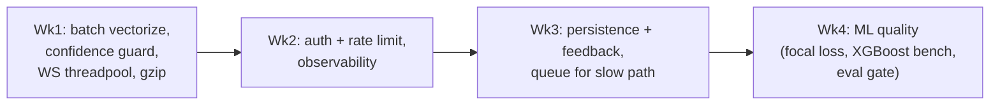

# 11 · Improvements (the 30-day roadmap)

> "If you had another month, what would you improve?" is a senior-signal question. Lead with impact,
> show you understand the tradeoffs, and order by ROI. Each item: **what · why · how · tradeoff.**

---

## Tier 1 — Quick, high-impact (week 1)

### 1. Vectorize batch inference
- **What:** in `predict_batch`, stack all rows into one `(n, 78, 1)` tensor and call `model.predict` **once** instead of n times.
- **Why:** the current per-row loop is the biggest throughput waste; TF batching is dramatically faster.
- **How:** build `np.stack`, scale in one `scaler.transform(X)`, single predict, then split results.
- **Tradeoff:** slightly more memory per request (bounded by the 5000-row cap); none meaningful.

### 2. Add a confidence threshold / OOD guard
- **What:** if max softmax prob < τ (e.g. 0.6), label `UNCERTAIN`/flag for review instead of forcing a class.
- **Why:** softmax is overconfident on out-of-distribution traffic; a security tool shouldn't assert a class it isn't sure about.
- **How:** post-process `infer_fast`; optionally add an anomaly/energy score.
- **Tradeoff:** introduces a tunable threshold and a new label the frontend must render.

### 3. Threadpool the WebSocket inference
- **What:** run `next_demo_alert()`'s blocking `predict` via `run_in_threadpool`.
- **Why:** keeps the event loop responsive under many WS clients.
- **Tradeoff:** negligible; correctness-only fix.

### 4. Response compression
- **What:** add `GZipMiddleware` (or nginx gzip) for large `/api/analyze` JSON.
- **Why:** alert lists + 78-feature SHAP arrays are big and compress well.
- **Tradeoff:** tiny CPU cost.

---

## Tier 2 — Productionization (weeks 2–3)

### 5. Authentication + rate limiting
- **What:** API keys (hashed) via a FastAPI dependency; per-key rate limits (slowapi/Redis).
- **Why:** the open SHAP path is a DoS magnet; multi-tenant needs identity.
- **How:** `Depends(require_key)` on routers; the service layer stays untouched (auth is transport).
- **Tradeoff:** key management/storage; onboarding friction for clients.

### 6. Alert persistence + analyst feedback
- **What:** the Postgres schema from [04](04-Data-and-Model-Store.md): runs, alerts, SHAP, feedback, model_version.
- **Why:** history/audit, and **feedback closes the ML loop** (mislabeled alerts → retraining data).
- **How:** async SQLAlchemy; append-only alert inserts; a `/feedback` endpoint.
- **Tradeoff:** introduces stateful infra → the scaling story now includes the DB.

### 7. Decouple the slow path with a queue
- **What:** `/api/analyze` and SHAP jobs → a queue (arq/Celery + Redis) returning a job id.
- **Why:** protects request latency; enables backpressure and retries.
- **Tradeoff:** async UX (poll/stream results); more moving parts.

### 8. Observability
- **What:** Prometheus metrics (latency p50/p99, per-class counts, SHAP duration), OpenTelemetry traces, structured JSON logs with request ids.
- **Why:** you can't operate at scale blind; also enables **drift detection** (prediction distribution over time).
- **Tradeoff:** instrumentation effort; small runtime overhead.

---

## Tier 3 — ML quality (weeks 3–4)

### 9. Fix the weak classes (Botnet recall 77.75%)
- **What:** class weights or **focal loss**; targeted oversampling for Botnet/Web-Attacks; threshold tuning per class.
- **Why:** macro-F1 is dragged by minorities; botnet flows mimic benign and are the real-world risk.
- **How:** re-train with `class_weight=` or focal loss; re-evaluate per-class recall, not just accuracy.
- **Tradeoff:** may trade a hair of majority-class precision for minority recall — usually worth it for security.

### 10. Benchmark XGBoost vs the CNN
- **What:** train an XGBoost baseline on the same features/splits.
- **Why:** on tabular data gradient-boosted trees are frequently equal/better and far cheaper + natively SHAP-friendly. Engineering honesty.
- **Tradeoff:** if XGBoost wins, you'd swap the serving model (the API/service layer barely changes — only `model.py`).

### 11. Adversarial robustness
- **What:** adversarial training / feature-perturbation testing; ensemble (CNN + tree).
- **Why:** a NIDS model is itself an attack target (evasion).
- **Tradeoff:** longer training; defense is never complete (arms race).

### 12. Proper model registry + automated eval gate
- **What:** version artifacts (MLflow/DVC); CI re-runs `eval_report.py` and **blocks** deploy if macro-F1 regresses.
- **Why:** prevents shipping a worse model; reproducible lineage.
- **Tradeoff:** MLOps setup cost.

---

## Tier 4 — Architecture / scale (stretch)

| Improvement | Why | Tradeoff |
|---|---|---|
| ONNX Runtime / TF-Serving / Triton | lower per-inference latency, dynamic batching | another serving component |
| WS pub/sub fan-out (Redis/NATS) | scale streaming horizontally | infra + delivery semantics |
| Real packet→flow ingestion (CICFlowMeter live) | move from demo to true real-time NIDS | significant new pipeline |
| Time-series store for alerts (Timescale/Clickhouse) | dashboards over millions of alerts | ops complexity |
| Multi-model / per-tenant models | different networks, different baselines | model lifecycle complexity |

---

## How I'd sequence it (the answer to "what first?")

> **The framing that impresses:** *"I'd spend week one on free wins that don't add infra — batch
> vectorization and a confidence guard. Then the two things that make it productionizable — auth/rate
> limiting and observability. Only then do I add stateful pieces (a history DB, a queue), because each
> one changes my scaling and failure model. ML-quality work (focal loss for Botnet recall, an XGBoost
> baseline) runs in parallel since it only touches `model.py`."*
